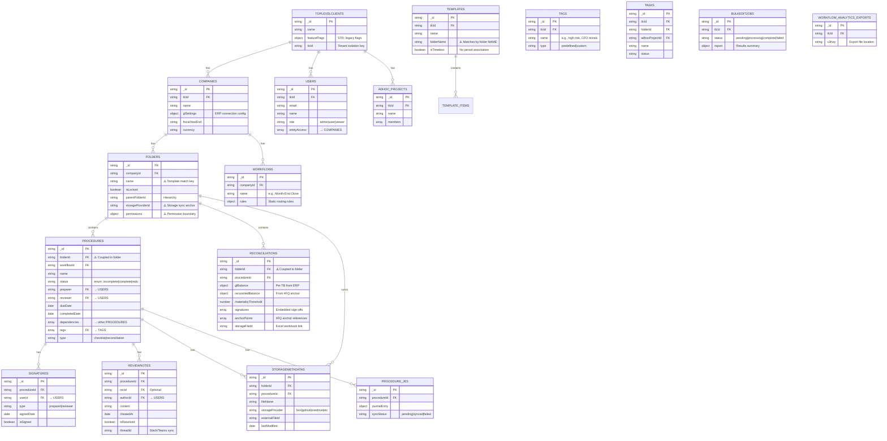

# Current State Entity-Relationship Diagram

**Purpose:** Document the current MongoDB/DocumentDB data model for FloQast Close, annotating the triple-duty folder problem and cross-service dependencies.

**Source:** `03_Technical_Architecture_Confluence.md` Sec 1.1, Sec 2, Sec 5

---

## Entity-Relationship Diagram (Mermaid)



---

## The Triple-Duty Folder Problem

The `FOLDERS` collection serves three fundamentally different purposes, creating tight coupling that cascades across the entire system:

```
                        ┌─────────────────────────┐
                        │        FOLDERS           │
                        │                          │
                ┌───────┤  1. ORGANIZATION         │
                │       │     - name               │
                │       │     - parentFolderId      │
                │       │     - hierarchy           │
                │       │                          │
                │       │  2. PERMISSIONS           │
                │       │     - permissions object  │
                │       │     - user access grants  │
                │       │     - entity scoping      │
                │       │                          │
                │       │  3. STORAGE SYNC          │
                │       │     - storageProviderId   │
                │       │     - cloud folder path   │
                │       │     - #FQ anchor location │
                └───────┤                          │
                        └─────────────────────────┘
                                    │
                    ┌───────────────┼───────────────┐
                    ▼               ▼               ▼
            ┌─────────────┐ ┌─────────────┐ ┌─────────────┐
            │ PROCEDURES  │ │ RECONCIL.   │ │ TEMPLATES   │
            │ folderId FK │ │ folderId FK │ │ folderName  │
            │             │ │             │ │ (match key) │
            └─────────────┘ └─────────────┘ └─────────────┘
```

### Cascading Impacts

| Action | Organization Impact | Permission Impact | Storage Impact |
|--------|-------------------|-------------------|----------------|
| **Rename folder** | Templates break (name-matching) | None | Storage sync path changes |
| **Merge folders** | Items may be orphaned/deleted | Permission grants must be rebuilt | Storage anchor points lost |
| **Delete folder** | All procedures orphaned | All user access revoked | All linked files disconnected |
| **Change permissions** | None | Desired effect | None |
| **Change storage provider** | None | None | All #FQ anchors break |

---

## Service-to-Collection Access Map

| Service | procedures | folders | companies | tlc | users | recs | reviewnotes | templates | tags | storage |
|---------|:---:|:---:|:---:|:---:|:---:|:---:|:---:|:---:|:---:|:---:|
| Checklist | RW | R | R | R | R | — | R | RW | R | RW |
| Items | RW | R | R | R | R | — | — | — | — | RW |
| Replication | RW | RW | R | R | — | — | — | — | — | — |
| Bulk Edit | RW | — | R | R | R | RW | — | RW | — | — |
| Review Notes | R | R | R | R | R | R | RW | — | — | — |
| Workflow Analytics | R | R | R | R | R | R | R | — | — | — |
| Tasks | — | R | — | R | — | — | — | — | — | — |
| Adhoc Projects | — | — | — | R | R | — | — | — | — | — |
| Recs | — | R | R | R | R | RW | R | R | R | — |

**Key observation:** The `procedures` collection is accessed by 6 services (read-write by 4). The `folders` collection is accessed by 7+ services. These are the two most heavily coupled collections in the system.

---

## Gold Layer (Snowflake Analytics)

The Close Gold Layer maps this operational data into a star schema:

```
                    ┌──────────────┐
                    │  dim_date    │
                    └──────┬───────┘
                           │
┌──────────────┐    ┌──────┴───────┐    ┌──────────────┐
│ dim_company  ├────┤ fact_close_  ├────┤ dim_project  │
│              │    │ item_status  │    │ (period)     │
└──────────────┘    └──────┬───────┘    └──────────────┘
                           │
                    ┌──────┴───────┐    ┌──────────────┐
                    │              ├────┤ dim_item_type│
                    │              │    └──────────────┘
                    │              │
                    │              ├────┐
                    └──────────────┘    │
                                 ┌─────┴──────┐
                                 │ dim_folder  │
                                 │ (optional)  │
                                 └────────────┘
```

**Note:** The Gold Layer's `dim_folder` is marked as "optional" — an early indicator that even the analytics team recognizes folders may not be a durable dimension.
