# Target State Entity-Relationship Diagram

**Purpose:** Define the full entity relationships for the proposed task-centric architecture, showing how the Super Task model connects to all surrounding entities.

---

## Target State ERD (Mermaid)

```mermaid
erDiagram
    TENANT ||--o{ ENTITY : "has"
    TENANT ||--o{ USER : "has"
    TENANT ||--o{ ROLE : "has"
    TENANT ||--o{ AGENT_CONFIG : "has"
    TENANT ||--o{ TEMPLATE : "has"
    TENANT {
        string id PK
        string name
        object settings
    }

    ENTITY ||--o{ PERIOD : "has"
    ENTITY ||--o{ ERP_CONNECTION : "has"
    ENTITY {
        string id PK
        string tenantId FK
        string name
        string region
        string fiscalYearEnd
        string currency
    }

    PERIOD ||--o{ SUPER_TASK : "contains"
    PERIOD {
        string id PK "YYYY-MM"
        string entityId FK
        string status "open|in_progress|closed|locked"
        date openedAt
        date closedAt
        number targetCloseDays
    }

    SUPER_TASK ||--o{ SUB_TASK : "contains"
    SUPER_TASK ||--o{ DOCUMENT : "has"
    SUPER_TASK ||--o{ REVIEW_NOTE : "has"
    SUPER_TASK ||--o{ TRANSACTION_LINK : "links"
    SUPER_TASK ||--o{ SIGNATURE : "has"
    SUPER_TASK ||--o{ DELEGATION : "has"
    SUPER_TASK ||--o{ AGENT_EXECUTION : "logged"
    SUPER_TASK ||--o{ AI_INSIGHT : "generated"
    SUPER_TASK ||--o{ STATUS_TRANSITION : "tracked"
    SUPER_TASK }o--o{ SUPER_TASK : "depends_on"
    SUPER_TASK }o--o{ TAG : "classified_by"
    SUPER_TASK {
        string id PK
        string tenantId FK
        string entityId FK
        string periodId FK
        string processGroup "Cash|AR|AP|Rev|etc"
        string accountId FK "GL account"
        string taskType "checklist|rec|compliance|etc"
        string status "event-driven state"
        string preparerId FK
        string reviewerId FK
        date dueDate
        string templateId FK
    }

    SUB_TASK ||--o{ AGENT_EXECUTION : "has"
    SUB_TASK {
        string id PK
        string taskId FK
        string title
        number order
        string status
        string assignmentType "human|agent|system"
        string assignedTo FK
    }

    PROCESS_GROUP {
        string id PK
        string tenantId FK
        string name "Cash and Banking"
        string category "balance_sheet|income_statement"
        number sortOrder
    }

    TAG {
        string id PK
        string tenantId FK
        string name
        string type "risk|workflow|custom"
        string color
    }

    TEMPLATE ||--o{ TEMPLATE_TASK : "defines"
    TEMPLATE {
        string id PK
        string tenantId FK
        string name
        string processGroup
        boolean isGlobal "Push to all entities"
        number version
    }

    TEMPLATE_TASK ||--o{ TEMPLATE_SUB_TASK : "defines"
    TEMPLATE_TASK {
        string id PK
        string templateId FK
        string title
        string taskType
        string defaultPreparer "role-based"
        string defaultReviewer "role-based"
        number defaultDueDayOffset
    }

    ROLE ||--o{ ROLE_PERMISSION : "grants"
    ROLE {
        string id PK
        string tenantId FK
        string name "AP Reviewer"
        string description
    }

    ROLE_PERMISSION {
        string id PK
        string roleId FK
        string action "review|prepare|view|admin"
        string scope_type "process_group|entity|tag|all"
        string scope_value "Accounts Payable|Entity A"
    }

    USER ||--o{ USER_ROLE : "has"
    USER ||--o{ USER_ENTITY : "assigned_to"
    USER {
        string id PK
        string tenantId FK
        string email
        string name
    }

    USER_ROLE {
        string userId FK
        string roleId FK
        string entityScope "specific|all"
    }

    USER_ENTITY {
        string userId FK
        string entityId FK
    }

    ERP_CONNECTION {
        string id PK
        string entityId FK
        string type "netsuite|dynamics|sap|generic"
        string status "active|error|disconnected"
        date lastSync
        object config
    }

    GL_ACCOUNT {
        string id PK
        string tenantId FK
        string accountNumber
        string accountName
        string type "asset|liability|equity|revenue|expense"
        string processGroup FK
    }

    TRANSACTION_LINK {
        string id PK
        string taskId FK
        string floLakeId "FloLake Silver Layer ref"
        string accountId FK
        number amount
        string currency
        date transactionDate
        string matchStatus
        number matchConfidence
    }

    DOCUMENT {
        string id PK
        string taskId FK
        string fileName
        string storageProvider
        string externalId
        boolean isLocked
        date uploadedAt
    }

    REVIEW_NOTE {
        string id PK
        string taskId FK
        string subTaskId FK "optional"
        string authorId FK
        string content
        string type "question|rejection|etc"
        boolean isResolved
        string parentNoteId "threading"
    }

    SIGNATURE {
        string id PK
        string taskId FK
        string userId FK
        string type "preparer|reviewer"
        date signedAt
        object balanceSnapshot "Point-in-time data"
    }

    DELEGATION {
        string id PK
        string taskId FK
        string originalUserId FK
        string delegateUserId FK
        date startDate
        date endDate
        boolean autoRevert
    }

    AGENT_CONFIG {
        string id PK
        string tenantId FK
        string name
        string type "matcher|classifier|generator"
        object rules
        string schedule
    }

    AGENT_EXECUTION {
        string id PK
        string taskId FK
        string subTaskId FK
        string agentId FK
        date executedAt
        string status "success|partial|failed"
        number itemsProcessed
        number estimatedHoursSaved
    }

    AI_INSIGHT {
        string id PK
        string taskId FK
        string type "anomaly|recommendation|prediction"
        string title
        string description
        number confidence
    }

    STATUS_TRANSITION {
        string id PK
        string taskId FK
        string fromStatus
        string toStatus
        string triggeredBy "event type"
        string userId FK "optional"
        date occurredAt
    }

    SAVED_VIEW {
        string id PK
        string tenantId FK
        string userId FK "optional - shared vs personal"
        string name
        object filters "entity, processGroup, tags, etc"
        object sorting
        object grouping
    }

    WORKFLOW_RULE {
        string id PK
        string tenantId FK
        string eventType "status_change|data_arrival|etc"
        object conditions
        object actions "notify|assign|trigger_agent|etc"
    }
```



---

## Key Structural Changes from Current State

### What's New
| Entity | Purpose | Replaces |
|--------|---------|----------|
| `SUPER_TASK` | Unified task container | `procedures` + `reconciliations` + `tasks` |
| `SUB_TASK` | Discrete SOP steps within a task | Nothing (new concept) |
| `PROCESS_GROUP` | Named work stream grouping | `folders` (organization role) |
| `ROLE` + `ROLE_PERMISSION` | ReBAC permission model | `folders.permissions` |
| `DELEGATION` | Self-service PTO coverage | Manual admin reassignment |
| `AGENT_EXECUTION` | AI agent run logs with ROI | Nothing (new concept) |
| `AI_INSIGHT` | System-generated observations | Nothing (new concept) |
| `TRANSACTION_LINK` | FloLake transaction bridge | Nothing (new concept) |
| `SAVED_VIEW` | Personalized list configurations | Nothing (hardcoded views) |
| `WORKFLOW_RULE` | Event-driven automation rules | `workflows.rules` (static) |
| `STATUS_TRANSITION` | Complete state change audit log | Partial (`signatures`) |

### What's Removed
| Entity | Reason |
|--------|--------|
| `FOLDERS` | Replaced by `PROCESS_GROUP` (org), `ROLE` (perms), `DOCUMENT.storageProvider` (storage) |
| `ADHOC_PROJECTS` | Absorbed into `SUPER_TASK` with `taskType: 'ad_hoc'` |
| `TASKS` (ad-hoc) | Absorbed into `SUB_TASK` or `SUPER_TASK` |
| `STORAGEMETADATAS` | Absorbed into `DOCUMENT` entity |
| `PROCEDURE_JES` | Absorbed into `SUPER_TASK.journalEntries` |
| `BULKEDITJOBS` | Replaced by event-driven `WORKFLOW_RULE` batch processing |

### What's Evolved
| Current | Target | Change |
|---------|--------|--------|
| `procedures` | `SUPER_TASK` | Rich container with sub-tasks, agents, transactions |
| `reconciliations` | `SUPER_TASK` (type: rec) + `ReconciliationData` | Unified entity with type-specific extension |
| `templates` | `TEMPLATE` + `TEMPLATE_TASK` + `TEMPLATE_SUB_TASK` | Hierarchical templates with global push |
| `reviewnotes` | `REVIEW_NOTE` | Enhanced with threading, types, sub-task scope |
| `tags` | `TAG` | Same concept, expanded role (replaces folders for grouping) |
| `workflows` | `WORKFLOW_RULE` | Event-driven rules replace static routing |
| `companies` | `ENTITY` | Simplified; ERP config moved to `ERP_CONNECTION` |

---

## Relationship Summary

```
TENANT
  ├── ENTITY
  │     ├── PERIOD
  │     │     └── SUPER_TASK ──────────────────────────┐
  │     │           ├── SUB_TASK                        │
  │     │           │     └── AGENT_EXECUTION           │
  │     │           ├── DOCUMENT                        │
  │     │           ├── REVIEW_NOTE                     │
  │     │           ├── SIGNATURE                       │
  │     │           ├── DELEGATION                      │
  │     │           ├── TRANSACTION_LINK → FloLake      │
  │     │           ├── AI_INSIGHT                      │
  │     │           ├── STATUS_TRANSITION               │
  │     │           └── DEPENDENCY ──────► SUPER_TASK ──┘
  │     └── ERP_CONNECTION
  ├── USER
  │     ├── USER_ROLE → ROLE → ROLE_PERMISSION
  │     ├── USER_ENTITY → ENTITY
  │     └── SAVED_VIEW
  ├── GL_ACCOUNT → PROCESS_GROUP
  ├── TAG
  ├── TEMPLATE → TEMPLATE_TASK → TEMPLATE_SUB_TASK
  ├── AGENT_CONFIG
  └── WORKFLOW_RULE
```
