# Service Architecture — C4 Level 1 (System Context)

**Purpose:** Define the proposed service boundaries, communication patterns, and migration strategy for the FloQast Close rearchitecture. This document presents a C4 Level 1 (System Context) view of the target-state architecture, mapping how eight bounded services replace the current Lambda-based monolith.

**Author:** Benjamin Ellis, Product Design Manager
**Date:** March 2, 2026
**Status:** Proposed — Living Document

**References:**
- Phase 2: Super Task Model Specification (`Phase2_Task_Data_Model/02_Super_Task_Model_Specification.md`)
- Current Architecture: `03_Technical_Architecture_Confluence.md` (Sam Hall's C4 Level 2 series, Feb 25 2026)
- Project Catalyst: `04_Project_Catalyst_Reference.md`
- GAuth ADR: Confluence page 4445569040 (Kristopher Morris, Feb 25 2026)
- Service Design Template: Confluence page 4310138909 (Mark Thomas, Jan 08 2026)

---

## 1. System Context Diagram (C4 Level 1)

### 1.1 Mermaid Diagram

```mermaid
C4Context
    title FloQast Close — Target-State System Context (C4 Level 1)

    Person(accountant, "Accountant (Preparer)", "Staff accountant performing close tasks, uploading evidence, executing reconciliations")
    Person(reviewer, "Reviewer", "Senior accountant or manager reviewing work, approving sign-offs, adding review notes")
    Person(manager, "Manager / Controller", "Monitors close progress, manages assignments, views analytics and timelines")
    Person(admin, "Admin", "Configures entities, templates, integrations, roles, and permissions")

    Enterprise_Boundary(fq, "FloQast Close Platform") {

        System(taskService, "Task Service", "Core CRUD for Super Tasks. Owns task lifecycle, sub-tasks, assignments, sign-offs, review notes, dependencies.")
        System(workflowEngine, "Workflow Engine", "Event-driven orchestration. State transitions, dependency resolution, notifications, replication.")
        System(searchService, "Search Service", "Full-text and faceted search across tasks, accounts, entities, transactions. Powers global search bar.")
        System(docService, "Document Service", "Decoupled document management. File storage, cloud provider integrations, document lifecycle.")
        System(permService, "Permission Service (ReBAC)", "Relationship-based access control. Role grants, entity scoping, SOX segregation of duties.")
        System(aiOrch, "AI Orchestration", "Unified AI layer. Agent management, matching, anomaly detection, NLP queries, checklist generation.")
        System(analyticsService, "Analytics Service", "Dashboards, ROI metrics, close duration, on-time %, cross-entity benchmarking.")
        System(integrationService, "Integration Service (FloLake)", "Shared data ingestion. ERP connectors, bank feeds, sub-ledger imports, Silver Layer normalization.")

    }

    System_Ext(erp, "ERP Systems", "NetSuite, SAP, Dynamics 365, Odoo, Sage, Workday Financials")
    System_Ext(bank, "Banking Systems", "Trovata, BAI2 feeds, direct bank APIs")
    System_Ext(cloud, "Cloud Storage", "SharePoint, OneDrive, Google Drive, Box, Dropbox, Egnyte")
    System_Ext(collab, "Collaboration Platforms", "Slack, Microsoft Teams")
    System_Ext(llm, "AI/LLM Providers", "OpenAI (GPT-4o), AWS Bedrock (Claude 3.5 Sonnet)")

    Rel(accountant, taskService, "Creates, updates, signs off tasks")
    Rel(accountant, searchService, "Finds work via global search")
    Rel(accountant, docService, "Uploads/downloads evidence files")
    Rel(reviewer, taskService, "Reviews, approves, adds review notes")
    Rel(reviewer, searchService, "Searches for items pending review")
    Rel(manager, analyticsService, "Views dashboards, close timelines")
    Rel(manager, searchService, "Searches across entities and periods")
    Rel(admin, permService, "Configures roles, entity access, controls")
    Rel(admin, integrationService, "Sets up ERP, bank, storage connections")

    Rel(integrationService, erp, "Pulls trial balance, GL data, transactions")
    Rel(integrationService, bank, "Pulls bank statements, transaction feeds")
    Rel(docService, cloud, "Syncs workpapers, reconciliation files")
    Rel(workflowEngine, collab, "Sends notifications, syncs review notes")
    Rel(aiOrch, llm, "Sends structured prompts, receives completions")

    Rel(taskService, workflowEngine, "Emits task lifecycle events")
    Rel(taskService, permService, "Checks authorization on every operation")
    Rel(workflowEngine, taskService, "Triggers state transitions, auto-assignments")
    Rel(searchService, taskService, "Subscribes to task change events for indexing")
    Rel(analyticsService, taskService, "Subscribes to task events for KPI computation")
    Rel(aiOrch, taskService, "Reads task context, writes agent results")
    Rel(integrationService, taskService, "Delivers normalized GL/transaction data to tasks")

    UpdateRelStyle(accountant, taskService, $offsetY="-10")
    UpdateRelStyle(manager, analyticsService, $offsetY="-10")
```



### 1.2 Text-Based System Context Diagram

```
                                  ┌──────────────────────────────────────────┐
                                  │          EXTERNAL ACTORS                 │
                                  ├──────────────────────────────────────────┤
                                  │  Accountant    Reviewer    Manager  Admin│
                                  └─────┬──────────┬──────────┬─────────┬───┘
                                        │          │          │         │
                        ┌───────────────┼──────────┼──────────┼─────────┼───────────────┐
                        │               ▼          ▼          ▼         ▼               │
                        │  ┌─────────────────────────────────────────────────────────┐  │
                        │  │              API GATEWAY  (fq-gateway / GAuth)          │  │
                        │  │         Authentication, Rate Limiting, Routing          │  │
                        │  └────┬──────┬──────┬──────┬──────┬──────┬──────┬─────────┘  │
                        │       │      │      │      │      │      │      │             │
                        │       ▼      ▼      ▼      ▼      ▼      ▼      ▼             │
                        │  ┌────────┐ ┌────┐ ┌────┐ ┌────┐ ┌────┐ ┌────┐ ┌──────────┐  │
                        │  │ Task   │ │Work│ │Srch│ │Doc │ │Perm│ │ AI │ │Analytics │  │
                        │  │Service │ │flow│ │Svc │ │Svc │ │Svc │ │Orch│ │ Service  │  │
                        │  │        │ │Eng │ │    │ │    │ │ReBA│ │    │ │          │  │
                        │  └───┬────┘ └─┬──┘ └─┬──┘ └─┬──┘ └─┬──┘ └─┬──┘ └────┬─────┘  │
                        │      │        │      │      │      │      │         │         │
                        │      └────────┴──────┴──┬───┴──────┴──────┴─────────┘         │
                        │                         ▼                                     │
                        │  ┌─────────────────────────────────────────────────────────┐  │
                        │  │                   EVENT BUS (SNS/SQS)                   │  │
                        │  │        Async communication between all services         │  │
                        │  └──────────────────────────┬──────────────────────────────┘  │
                        │                             │                                 │
                        │                             ▼                                 │
                        │  ┌─────────────────────────────────────────────────────────┐  │
                        │  │           Integration Service (FloLake)                 │  │
                        │  │       Shared data ingestion + Silver Layer              │  │
                        │  └──────┬──────────────┬───────────────┬──────────────────┘  │
                        │         │              │               │                      │
                        │  FLOQAST CLOSE PLATFORM │               │                      │
                        └─────────┼──────────────┼───────────────┼──────────────────────┘
                                  │              │               │
                                  ▼              ▼               ▼
                        ┌─────────────┐ ┌──────────────┐ ┌──────────────┐
                        │ ERP Systems │ │Banking Feeds │ │Cloud Storage │
                        │  NetSuite   │ │  Trovata     │ │  SharePoint  │
                        │  SAP        │ │  BAI2        │ │  OneDrive    │
                        │  Dynamics   │ │  Bank APIs   │ │  Google Drive│
                        │  Odoo/Sage  │ │              │ │  Box/Dropbox │
                        └─────────────┘ └──────────────┘ └──────────────┘

                        ┌──────────────┐  ┌──────────────────────┐
                        │  Slack/Teams │  │  AI/LLM Providers    │
                        │  (Notif.)    │  │  OpenAI, AWS Bedrock │
                        └──────────────┘  └──────────────────────┘
```

---

## 2. Service Definitions

### 2.1 Task Service

**Replaces:** Checklist Service (item, template, template-super Lambdas), Items Service, Tasks Service, Adhoc-Projects Service, Review Notes Service, Bulk Edit Service

**Responsibilities:**
- CRUD operations on the Super Task entity (see Phase 2 specification)
- Sub-task management (ordered steps within a task)
- Assignment management (preparer, reviewer, delegates)
- Sign-off lifecycle (prepare, review, revoke, redo)
- Review note threading (with Slack/Teams sync via Workflow Engine)
- Bulk edit operations (batched updates with concurrency controls)
- Template management (timeless definitions, period application)
- Dependency graph management (intra-task and cross-task)

**Data Ownership:**
- Primary store: MongoDB/DocumentDB — `super_tasks` collection (replaces `procedures`, `tasks`, `adhoc-projects`)
- Templates: `task_templates` collection (replaces `templates`)
- Review notes: embedded within Super Task document (replaces separate `reviewnotes` collection)
- Tags: `task_tags` collection (replaces `tags`)

**Key APIs:**
| Method | Endpoint | Description |
|--------|----------|-------------|
| `GET` | `/tasks/v1/tasks` | List tasks with filtering (entity, period, status, assignee, process group) |
| `POST` | `/tasks/v1/tasks` | Create a new Super Task |
| `GET` | `/tasks/v1/tasks/:taskId` | Get full task with sub-tasks, documents, review notes |
| `PUT` | `/tasks/v1/tasks/:taskId` | Update task properties |
| `POST` | `/tasks/v1/tasks/:taskId/signatures/:sigId/signoff` | Execute sign-off |
| `DELETE` | `/tasks/v1/tasks/:taskId/signatures/:sigId/signoff` | Revoke sign-off |
| `POST` | `/tasks/v1/tasks/:taskId/review-notes` | Add review note |
| `POST` | `/tasks/v1/tasks/:taskId/sub-tasks` | Add sub-task |
| `PUT` | `/tasks/v1/tasks/:taskId/sub-tasks/:subTaskId` | Update sub-task status |
| `POST` | `/tasks/v1/bulk` | Batch update tasks (assignments, status, tags) |
| `GET` | `/tasks/v1/templates` | List task templates |
| `POST` | `/tasks/v1/templates/:templateId/apply` | Apply template to a period |

**Communication:**
- **Emits events** to Event Bus on all state changes: `task.created`, `task.updated`, `task.signed_off`, `task.review_note.added`, `task.dependency.resolved`, `task.redo`
- **Synchronous calls** to Permission Service (ReBAC) for authorization checks on every mutating operation
- **Synchronous calls** to Document Service for file attachment validation

**Compute:** ECS (following the active Lambda-to-ECS migration pattern established by Checklist service migration). Minimum 3 / maximum 120 instances in production, CPU+Memory target 50%.

---

### 2.2 Workflow Engine

**Replaces:** Step Functions orchestration (Replication step functions, Bulk Edit step functions, Adhoc-Projects wizard), static rule routing, manual notification dispatch

**Responsibilities:**
- State machine execution for task lifecycle transitions
- Dependency resolution: when Task A completes, unblock Task B
- Period replication: monthly roll-forward of close structures (replaces 12+ Lambda / 4 Step Function replication system)
- Notification dispatch: email, Slack/Teams, AppSync WebSocket push
- Assignment rules: auto-assign based on templates, handle PTO delegation
- Escalation logic: overdue task escalation chains
- Workflow scheduling: calendar-day and business-day due date computation with holiday calendars

**Data Ownership:**
- `workflow_definitions` collection — workflow rules, escalation chains, replication configs
- `workflow_executions` collection — execution logs, state machine history
- Does NOT own task data — reads task state via Event Bus, writes state transitions back via Task Service API

**Key APIs:**
| Method | Endpoint | Description |
|--------|----------|-------------|
| `GET` | `/workflow/v1/definitions` | List workflow definitions |
| `POST` | `/workflow/v1/definitions` | Create workflow definition |
| `POST` | `/workflow/v1/replicate` | Trigger period replication |
| `GET` | `/workflow/v1/executions/:executionId` | Get execution status and history |
| `POST` | `/workflow/v1/rules/evaluate` | Evaluate routing rules for a task event |

**Communication:**
- **Consumes events** from Event Bus: `task.*`, `integration.data.available`, `permission.role.changed`
- **Emits events:** `workflow.task.transitioned`, `workflow.notification.sent`, `workflow.replication.completed`
- **Synchronous calls** to Task Service for state writes
- **Outbound** to Slack/Teams APIs for notification delivery
- **Outbound** to AppSync (WebSocket) for real-time UI updates

**Compute:** ECS with dedicated worker tier for long-running replication jobs. Replication uses SQS FIFO queues for ordered processing (replacing Step Functions).

**Design rationale:** The current architecture uses Step Functions for orchestration across Replication (4 step functions, 12+ Lambdas), Bulk Edit (7 Lambdas), and Adhoc-Projects. A centralized Workflow Engine consolidates this orchestration into a single, observable system with consistent retry/failure semantics and a unified execution log.

---

### 2.3 Search Service (NEW)

**Replaces:** Nothing — this is a net-new service. Currently, navigation is folder-hierarchy-based; no full-text or faceted search exists.

**Responsibilities:**
- Full-text search across tasks, accounts, entities, transactions, documents
- Faceted filtering: by entity, period, status, assignee, process group, tags, task type
- Saved searches and bookmarked queries
- Recent search history (per-user)
- Search suggestion and auto-complete
- Powers the Project Catalyst "Global Search Bar" and "Ask FloQast" integration

**Data Ownership:**
- Search index: Elasticsearch or OpenSearch cluster (dedicated)
- `search_bookmarks` collection (MongoDB) — user-saved searches
- Does NOT own source data — indexes are projections built from event subscriptions

**Key APIs:**
| Method | Endpoint | Description |
|--------|----------|-------------|
| `GET` | `/search/v1/query` | Full-text search with facets, pagination, sorting |
| `GET` | `/search/v1/suggest` | Auto-complete suggestions |
| `GET` | `/search/v1/facets` | Available facet values for current query context |
| `GET` | `/search/v1/recent` | User's recent searches |
| `POST` | `/search/v1/bookmarks` | Save a search query |
| `GET` | `/search/v1/bookmarks` | List saved searches |

**Communication:**
- **Consumes events** from Event Bus: `task.*`, `integration.data.available`, `document.*`, `permission.*` (to rebuild index projections)
- **Synchronous calls** to Permission Service (ReBAC) to filter search results by user's access grants — search results must never leak tasks the user cannot access
- No outbound events — read-only projection service

**Compute:** ECS for the API tier. Elasticsearch/OpenSearch cluster managed separately (AWS OpenSearch Service). Index rebuild workers consume from dedicated SQS queues.

**Phase-in strategy:** Project Catalyst plans to phase search in over 2-3 quarters, starting with checklist items and compliance tasks, then expanding to full platform coverage. The Search Service should support incremental index expansion without requiring full re-indexing.

---

### 2.4 Document Service

**Replaces:** Storage Provider Lambdas (`fq-storage-provider-box`, `fq-storage-provider-egnyte`, `fq-storage-provider-dropbox`, `fq-storage-provider-gdrive`, `fq-storage-provider-onedrive`), document attachment logic embedded in Checklist/Items services, `storagemetadatas` collection

**Responsibilities:**
- Document upload, download, versioning, and lifecycle management
- Cloud storage provider integration (SharePoint, OneDrive, Google Drive, Box, Dropbox, Egnyte)
- Document sync status tracking (linked vs. uploaded vs. synced)
- File-level locking after sign-off (read-only enforcement)
- #FQ Anchor Point parsing for legacy reconciliation workbooks (transitional)
- Document metadata indexing (emits events for Search Service)
- Virus scanning and file validation
- Pre-signed URL generation for direct S3 uploads/downloads

**Data Ownership:**
- `documents` collection — document metadata, sync status, version history
- `storage_connections` collection — per-tenant cloud storage configurations
- S3: `${env}-document-store` bucket for FloQast-hosted files
- Does NOT own task relationships — tasks reference documents by ID

**Key APIs:**
| Method | Endpoint | Description |
|--------|----------|-------------|
| `POST` | `/documents/v1/upload` | Upload a document (returns pre-signed S3 URL) |
| `GET` | `/documents/v1/:documentId` | Get document metadata |
| `GET` | `/documents/v1/:documentId/download` | Get download URL (pre-signed) |
| `DELETE` | `/documents/v1/:documentId` | Delete document |
| `POST` | `/documents/v1/:documentId/lock` | Lock document (post-sign-off) |
| `GET` | `/documents/v1/sync-status` | Check cloud storage sync status |
| `POST` | `/documents/v1/connections` | Configure a cloud storage connection |
| `GET` | `/documents/v1/anchor-scan/:documentId` | Parse #FQ anchor points (transitional) |

**Communication:**
- **Emits events:** `document.uploaded`, `document.synced`, `document.deleted`, `document.anchor.parsed`
- **Consumes events:** `task.signed_off` (to trigger document locking)
- **Outbound** to cloud storage provider APIs (SharePoint Graph API, Google Drive API, Box API, Dropbox API, Egnyte API)

**Compute:** ECS for API tier. Dedicated worker tier for cloud storage sync jobs (polling-based for providers without webhook support).

---

### 2.5 Permission Service (ReBAC)

**Replaces:** Folder-level permissioning, `fq-auth-middleware` (for authorization, not authentication), per-service `tlcId` filtering logic

**Note:** Authentication remains the responsibility of GAuth (`pl-global-auth-gw`). The Permission Service handles authorization only — "given that the user is who they say they are, what are they allowed to do?"

**Responsibilities:**
- Relationship-Based Access Control (ReBAC) evaluation
- Role definitions: Admin, Manager, Reviewer, Preparer (with custom roles)
- Entity-level and process-group-level access grants
- SOX segregation of duties enforcement (preparer cannot review their own work)
- Permission evaluation API: "Can user X perform action Y on resource Z?"
- Role inheritance and delegation chains
- Audit logging of permission changes and access decisions

**Data Ownership:**
- `roles` collection — role definitions with permission sets
- `grants` collection — user-to-resource relationship tuples (user, role, resource_type, resource_id)
- `audit_log` collection — permission change history
- Multi-tenancy: all data scoped by `tlcId`

**Key APIs:**
| Method | Endpoint | Description |
|--------|----------|-------------|
| `POST` | `/permissions/v1/check` | Evaluate: can user perform action on resource? Returns allow/deny |
| `POST` | `/permissions/v1/check-batch` | Batch evaluation (for list views — check N resources at once) |
| `GET` | `/permissions/v1/grants` | List grants for a user or resource |
| `POST` | `/permissions/v1/grants` | Create a permission grant |
| `DELETE` | `/permissions/v1/grants/:grantId` | Revoke a permission grant |
| `GET` | `/permissions/v1/roles` | List role definitions |
| `POST` | `/permissions/v1/roles` | Create custom role |
| `GET` | `/permissions/v1/audit-log` | Query permission change history |

**Communication:**
- **Emits events:** `permission.grant.created`, `permission.grant.revoked`, `permission.role.changed`
- **Synchronous inbound** from all services — every service calls Permission Service to authorize operations. This is the single enforcement point.
- **Low-latency requirement:** Permission checks are in the critical path of every API call. Must support <10ms p99 latency via in-memory caching with event-driven invalidation.

**Compute:** ECS with aggressive horizontal scaling. Redis/ElastiCache for permission decision caching. Cache invalidation via SNS subscription to permission change events.

**Migration note:** During transition, the Permission Service must support a "folder compatibility mode" that maps legacy folder-level permissions to ReBAC grants. This allows incremental migration without a big-bang permission cutover. See `Phase2_Task_Data_Model/05_ReBAC_Conceptual_Model.md` for the full model.

---

### 2.6 AI Orchestration

**Replaces:** Five fragmented AI services — AI Matching System (Lambda, Node.js/Python, OpenAI), FloQL Backend (Lambda, Python, Bedrock), Monitors Agent (Bedrock Agent), Remind Language Processor (Lambda, Node.js, OpenAI), Checkmate API (Lambda, Node.js, OpenAI)

**Responsibilities:**
- Unified interface for all AI capabilities
- Agent lifecycle management: create, configure, execute, monitor, audit
- Prompt management and version control
- AI model routing: direct requests to appropriate provider (OpenAI vs. Bedrock) based on capability
- Transaction matching orchestration (currently the most complex AI pipeline)
- Natural language query processing (FloQL / "Ask FloQast")
- Anomaly detection and monitoring (Monitors Agent)
- Review note and notification language generation (Remind)
- Checklist template generation (Checkmate)
- ROI tracking: hours saved, accuracy metrics per agent execution
- Tenant data isolation enforcement (structured fields only to LLMs; no `tlcId`, no raw files)

**Data Ownership:**
- `agents` collection — agent configurations, matching rules, MatchQL definitions
- `agent_executions` collection — execution history, results, ROI metrics
- `prompts` collection — versioned prompt templates
- S3: `${env}-ai-workspace` bucket for intermediate computation data
- Snowflake: per-tenant schemas (`TLC_{tlcId}`) for analytical queries (FloQL)

**Key APIs:**
| Method | Endpoint | Description |
|--------|----------|-------------|
| `GET` | `/ai/v1/agents` | List configured agents for a tenant |
| `POST` | `/ai/v1/agents` | Create/configure an agent |
| `POST` | `/ai/v1/agents/:agentId/execute` | Trigger agent execution |
| `GET` | `/ai/v1/agents/:agentId/executions` | List execution history with ROI |
| `POST` | `/ai/v1/query` | Natural language query (FloQL / "Ask FloQast") |
| `POST` | `/ai/v1/match` | Execute transaction matching |
| `GET` | `/ai/v1/insights/:taskId` | Get AI-generated insights for a task |
| `POST` | `/ai/v1/generate/checklist` | Generate checklist template from description |

**Communication:**
- **Consumes events:** `task.created` (for auto-insight generation), `integration.data.available` (for auto-matching triggers)
- **Emits events:** `ai.agent.completed`, `ai.insight.generated`, `ai.match.completed`
- **Outbound** to OpenAI API (GPT-4o) and AWS Bedrock (Claude 3.5 Sonnet) — model selection is internal routing logic
- **Synchronous calls** to Task Service for context retrieval and result persistence

**Compute:** ECS for API tier. Dedicated worker tier for long-running agent executions. Python runtime for matching code execution (hardened sandbox with VPC isolation, no internet gateway — maintaining existing security controls from `fq-matching-copilot-code-runner-lambda`).

**Security:** Inherits the AI Matching code execution security model: network-isolated VPC, no internet gateway, S3-only egress, IAM DENY on SSM/Secrets Manager, limited Python runtime (`re`, `pandas`, `defaultdict`), regex code validation, 900s timeout, 10GB memory cap. See Section 4.3 of `03_Technical_Architecture_Confluence.md`.

---

### 2.7 Analytics Service

**Replaces:** Workflow Analytics Service (currently migrating from Lambda to ECS as `workflow-analytics_service`), Close Gold Layer queries

**Responsibilities:**
- Close progress dashboards (entity-level, cross-entity)
- On-time percentage KPIs (see Gold Layer `fact_close_item_status`)
- Days-to-close trending
- Bottleneck identification (recurring late items, overloaded assignees)
- Workload allocation views
- Review note volume and resolution time metrics
- AI ROI aggregation (hours saved across all agent executions)
- Cross-entity benchmarking
- Export to Excel/PDF (S3-based with WebSocket notification for completion)
- Close Timeline / Gantt data (powering Project Catalyst's timeline view)

**Data Ownership:**
- Snowflake: Gold Layer star schema (`dim_date`, `dim_company`, `dim_project`, `dim_item_type`, `dim_folder`, `fact_close_item_status`)
- `analytics_exports` collection (MongoDB) — export job metadata
- S3: `${env}-analytics-exports` bucket for generated report files
- Separate analytics database via `fq-layer-analytics-db` (existing pattern)

**Key APIs:**
| Method | Endpoint | Description |
|--------|----------|-------------|
| `GET` | `/analytics/v1/progress` | Close progress by entity, period, process group |
| `GET` | `/analytics/v1/trends` | Historical trends (close duration, on-time %, late items) |
| `GET` | `/analytics/v1/bottlenecks` | Recurring bottleneck identification |
| `GET` | `/analytics/v1/workload` | Workload distribution across team members |
| `GET` | `/analytics/v1/timeline` | Timeline/Gantt data for close visualization |
| `GET` | `/analytics/v1/roi` | AI automation ROI metrics |
| `POST` | `/analytics/v1/exports` | Trigger Excel/PDF export |
| `GET` | `/analytics/v1/exports/:exportId` | Get export status and download URL |

**Communication:**
- **Consumes events:** `task.*`, `ai.agent.completed`, `workflow.replication.completed`
- **Emits events:** `analytics.export.ready` (triggers WebSocket notification to user)
- **Outbound** to AppSync WebSocket for real-time export completion notifications
- **Read-only projection** — Analytics Service never writes to task data; it maintains its own materialized views in Snowflake

**Compute:** ECS for API tier (existing `workflow-analytics_service` migration provides the foundation). Dedicated export workers for Excel/PDF generation (1024 CPU, 2GB memory — matching existing Report Builder worker specs).

---

### 2.8 Integration Service (FloLake)

**Replaces:** GL Provider Lambdas (`fq-gl-netsuite`, `fq-gl-ms-dynamics`, `fq-gl-sap`, `fq-gl-tb`), credential management (`fq-gl-creds-lambda`), FDM sync patterns, manual SFTP pipelines

**Responsibilities:**
- Unified ERP data ingestion (trial balance, GL transactions, chart of accounts)
- Bank feed ingestion (Trovata, BAI2, direct bank APIs)
- Sub-ledger data imports (AP, AR, inventory)
- Silver Layer normalization: all incoming data normalized to a canonical schema before distribution
- Connection management: OAuth tokens, API keys, SFTP credentials
- Sync scheduling: configurable cadence (15-minute, hourly, daily, manual)
- Data quality validation and error reporting
- FDM (Financial Data Model) dimension grouping — organizing ERP data into custom categories
- SNS broadcast on data availability (existing pattern from Reporting team's FloLake implementation)

**Data Ownership:**
- Snowflake: Silver Layer tables (normalized ERP data, schema-per-tenant `TLC_{tlcId}`)
- `connections` collection (MongoDB) — integration configurations, credentials, sync schedules
- `sync_jobs` collection — ingestion job history, error logs
- S3: `${env}-integration-staging` bucket for raw file uploads (SFTP, CSV)

**Key APIs:**
| Method | Endpoint | Description |
|--------|----------|-------------|
| `GET` | `/integrations/v1/connections` | List configured integrations |
| `POST` | `/integrations/v1/connections` | Create integration connection |
| `POST` | `/integrations/v1/connections/:connId/sync` | Trigger manual sync |
| `GET` | `/integrations/v1/connections/:connId/status` | Get sync status and last sync time |
| `GET` | `/integrations/v1/trial-balance` | Get current trial balance for entity/period |
| `GET` | `/integrations/v1/transactions` | Query normalized transactions |
| `POST` | `/integrations/v1/upload` | Upload CSV/Excel for manual ingestion |
| `GET` | `/integrations/v1/fdm/groupings` | Get FDM dimension groupings |

**Communication:**
- **Emits events:** `integration.data.available` (SNS broadcast — existing Reporting pattern), `integration.sync.failed`, `integration.connection.configured`
- **Consumes events:** (internal only — scheduled sync triggers)
- **Outbound** to ERP APIs (NetSuite SuiteTalk, SAP OData, Dynamics Dataverse, etc.)
- **Outbound** to banking APIs (Trovata, BAI2 endpoints)
- **Inbound** from external SFTP servers (pull-based)

**Compute:** ECS for API tier. Dedicated sync workers per integration type. SQS FIFO queues for ordered sync processing. Follows the FDM service pattern: `integration_api-service` (HTTP) + `integration_sync-worker` (cron/event-driven).

---

## 3. Communication Patterns

### 3.1 Synchronous vs. Asynchronous

```
┌──────────────────────────────────────────────────────────────────────┐
│                    COMMUNICATION PATTERN MAP                        │
├──────────────────────────────────────────────────────────────────────┤
│                                                                      │
│  SYNCHRONOUS (HTTP/gRPC — used for real-time, user-facing flows)     │
│  ─────────────────────────────────────────────────────────────────    │
│  • Task Service ──► Permission Service (ReBAC)                       │
│      Every mutating API call checks authorization synchronously.     │
│      Latency budget: <10ms p99 (cached).                             │
│                                                                      │
│  • Task Service ──► Document Service                                 │
│      Validate document exists before attaching to task.              │
│                                                                      │
│  • Search Service ──► Permission Service (ReBAC)                     │
│      Filter search results by user access. Called per query.         │
│                                                                      │
│  • All Services ──► GAuth Gateway                                    │
│      Token validation on every inbound request.                      │
│                                                                      │
│  ASYNCHRONOUS (SNS/SQS Event Bus — used for decoupled reactions)     │
│  ─────────────────────────────────────────────────────────────────    │
│  • Task Service ──►(event bus)──► Workflow Engine                    │
│      Task lifecycle events trigger state machine evaluations.        │
│                                                                      │
│  • Task Service ──►(event bus)──► Search Service                     │
│      Task changes trigger index updates. Eventual consistency OK.    │
│                                                                      │
│  • Task Service ──►(event bus)──► Analytics Service                  │
│      Task events feed KPI materialization. Batch-tolerant.           │
│                                                                      │
│  • Integration Service ──►(event bus)──► Task Service                │
│      New GL/transaction data triggers rec balance refresh.           │
│                                                                      │
│  • Integration Service ──►(event bus)──► Analytics Service           │
│      Data availability triggers dashboard refresh.                   │
│                                                                      │
│  • Workflow Engine ──►(event bus)──► Notification targets            │
│      Slack, Teams, email, AppSync WebSocket.                         │
│                                                                      │
│  • AI Orchestration ──►(event bus)──► Task Service                   │
│      Agent completion results written back to tasks.                 │
│                                                                      │
│  • Document Service ──►(event bus)──► Search Service                 │
│      Document changes trigger search index update.                   │
│                                                                      │
│  REAL-TIME (AppSync WebSocket — used for UI push)                    │
│  ─────────────────────────────────────────────────────────────────    │
│  • Workflow Engine ──► AppSync ──► Browser                           │
│      Task status changes, notification badges, export completion.    │
│                                                                      │
│  • Analytics Service ──► AppSync ──► Browser                         │
│      Export ready notifications.                                     │
│                                                                      │
└──────────────────────────────────────────────────────────────────────┘
```

### 3.2 Event Bus Design

The event bus uses **AWS SNS (fan-out) with SQS (per-consumer queues)**, matching the pattern already proven in production by the Reporting team's FDM service (FloLake SNS broadcast consumed by SQS subscribers).

**Topic structure:**
| SNS Topic | Publishers | Subscribers |
|-----------|-----------|-------------|
| `fq-task-events` | Task Service | Workflow Engine, Search Service, Analytics Service, AI Orchestration |
| `fq-workflow-events` | Workflow Engine | Task Service, Analytics Service |
| `fq-integration-events` | Integration Service | Task Service, Analytics Service, Search Service |
| `fq-document-events` | Document Service | Search Service, Task Service |
| `fq-permission-events` | Permission Service | Search Service (index rebuild), Workflow Engine (role-based routing) |
| `fq-ai-events` | AI Orchestration | Task Service, Analytics Service |
| `fq-analytics-events` | Analytics Service | (AppSync WebSocket relay) |

**Event envelope schema:**
```json
{
  "eventId": "uuid",
  "eventType": "task.signed_off",
  "source": "task-service",
  "timestamp": "2026-03-01T12:00:00Z",
  "tlcId": "tenant-123",
  "entityId": "entity-456",
  "correlationId": "request-uuid",
  "data": {
    "taskId": "task-789",
    "signatureId": "sig-012",
    "signedBy": "user-345",
    "signatureType": "preparer"
  }
}
```

**Guarantees:**
- At-least-once delivery (SQS standard queues with DLQ for failures)
- FIFO ordering where required (SQS FIFO queues for replication, bulk operations)
- Message deduplication via `eventId`
- Dead-letter queue monitoring with CloudWatch alarms

### 3.3 Current-State vs. Target-State Communication

| Current Pattern | Problem | Target Pattern |
|----------------|---------|----------------|
| Direct Lambda invocation (Checklist → GL Providers) | Tight coupling, no retry semantics, no observability | Integration Service with SNS/SQS event-driven data delivery |
| Step Functions (Replication, Bulk Edit, Adhoc-Projects) | Bespoke per-service, no shared execution model, hard to observe | Workflow Engine with unified execution log |
| No async messaging for most Close services | Synchronous chains create cascading failures | Event Bus (SNS/SQS) for all cross-service communication |
| AppSync WebSocket (notification push) | Kept as-is — proven pattern | AppSync WebSocket (no change) |
| `fq-auth-middleware` in every service | 173+ services with inconsistent auth | GAuth Gateway (centralized) + Permission Service (centralized authorization) |

---

## 4. Data Store Architecture

### 4.1 Data Store by Service

| Service | Primary Store | Secondary Store | Cache |
|---------|--------------|-----------------|-------|
| Task Service | MongoDB/DocumentDB (`super_tasks`, `task_templates`, `task_tags`) | — | ElastiCache (hot task lookups) |
| Workflow Engine | MongoDB/DocumentDB (`workflow_definitions`, `workflow_executions`) | — | — |
| Search Service | AWS OpenSearch (search indices) | MongoDB (`search_bookmarks`) | — |
| Document Service | MongoDB/DocumentDB (`documents`, `storage_connections`) | S3 (`${env}-document-store`) | — |
| Permission Service (ReBAC) | MongoDB/DocumentDB (`roles`, `grants`, `audit_log`) | — | ElastiCache (permission decisions, <10ms p99) |
| AI Orchestration | MongoDB/DocumentDB (`agents`, `agent_executions`, `prompts`) | S3 (`${env}-ai-workspace`), Snowflake (`TLC_{tlcId}`) | — |
| Analytics Service | Snowflake (Gold Layer star schema) | MongoDB (`analytics_exports`) | ElastiCache (dashboard aggregates) |
| Integration Service (FloLake) | Snowflake (Silver Layer, `TLC_{tlcId}`) | MongoDB (`connections`, `sync_jobs`), S3 (`${env}-integration-staging`) | S3 (COA cache, existing pattern) |

### 4.2 Multi-Tenancy Model (Unchanged)

The existing multi-tenancy model is preserved:

| Layer | Isolation Strategy |
|-------|--------------------|
| MongoDB/DocumentDB | Shared database, `tlcId` filter on all queries (enforced at DAO layer) |
| Snowflake | Schema-per-tenant: `TLC_{tlcId}` |
| S3 | Path prefix: `${tlcId}/...` |
| OpenSearch | Index-per-tenant or filtered aliases (TBD based on scale testing) |
| ElastiCache | Key prefix: `${tlcId}:...` |
| AI/LLM | Data pre-isolated before reaching AI; `tlcId` never sent to LLM providers |

---

## 5. Migration Strategy — Strangler Fig Pattern

### 5.1 Approach

The migration follows a **strangler fig pattern** — new services are built alongside existing Lambda infrastructure, traffic is gradually routed to new services via feature flags and ALB routing rules, and legacy Lambdas are decommissioned once the new service handles 100% of traffic. This is the same pattern used in the current Checklist ECS migration (Phase 1-4 plan in Confluence page 4443996199).

### 5.2 Migration Phases

```
┌─────────────────────────────────────────────────────────────────────┐
│                     MIGRATION TIMELINE                              │
├─────────────────────────────────────────────────────────────────────┤
│                                                                      │
│  PHASE 0: FOUNDATIONS (Parallel to current ECS migration)            │
│  ─────────────────────────────────────────────────────────           │
│  • Complete GAuth migration (Phases A-C of GAuth ADR)                │
│  • Complete Checklist item Lambda → ECS migration                    │
│  • Complete Review Notes Lambda → ECS migration                      │
│  • Complete Workflow Analytics Lambda → ECS migration                 │
│  • Establish SNS/SQS Event Bus infrastructure                        │
│  • Deploy Permission Service (ReBAC) in shadow mode                  │
│      (evaluates permissions alongside legacy folder checks,          │
│       logs discrepancies, does not enforce)                          │
│                                                                      │
│  PHASE 1: PERMISSION SERVICE + EVENT BUS                             │
│  ─────────────────────────────────────────────────────────           │
│  • Permission Service goes live (dual-mode: ReBAC + folder compat)   │
│  • Event Bus deployed; existing ECS services begin emitting events   │
│  • Search Service MVP deployed (indexes checklist items only)        │
│  • Metric: Permission Service handles 100% of auth checks            │
│                                                                      │
│  PHASE 2: TASK SERVICE (Core Cutover)                                │
│  ─────────────────────────────────────────────────────────           │
│  • Task Service deployed with Super Task model                       │
│  • Data migration: `procedures` → `super_tasks` (dual-write period)  │
│  • Checklist ECS routes redirected to Task Service                   │
│  • Items, Tasks, Adhoc-Projects Lambdas strangled                    │
│  • Review Notes integrated into Task Service                         │
│  • Bulk Edit rebuilt as Task Service batch API                       │
│  • Metric: Task Service handles 100% of CRUD operations              │
│                                                                      │
│  PHASE 3: WORKFLOW ENGINE + DOCUMENT SERVICE                         │
│  ─────────────────────────────────────────────────────────           │
│  • Workflow Engine replaces Step Functions orchestration              │
│  • Replication (4 step functions, 12+ Lambdas) → Workflow Engine     │
│  • Bulk Edit orchestration → Workflow Engine                         │
│  • Document Service consolidates Storage Provider Lambdas            │
│  • #FQ Anchor Point support maintained in Document Service           │
│  • Metric: Zero Step Function executions remaining                   │
│                                                                      │
│  PHASE 4: AI ORCHESTRATION + INTEGRATION SERVICE                     │
│  ─────────────────────────────────────────────────────────           │
│  • AI Orchestration unifies 5 AI services behind single interface    │
│  • Integration Service (FloLake) consolidates GL Provider Lambdas    │
│  • Silver Layer normalization active for all connected ERPs          │
│  • Metric: Single AI API, single integration API                     │
│                                                                      │
│  PHASE 5: SEARCH + ANALYTICS + CLEANUP                               │
│  ─────────────────────────────────────────────────────────           │
│  • Search Service expanded to full platform coverage                 │
│  • Analytics Service rebuilt on Gold Layer star schema                │
│  • Legacy Lambda decommissioning                                     │
│  • Legacy MongoDB collections archived                               │
│  • Feature flag cleanup                                              │
│  • Metric: Zero legacy Lambda invocations                            │
│                                                                      │
└─────────────────────────────────────────────────────────────────────┘
```

### 5.3 Dual-Write and Data Migration Strategy

The `procedures` → `super_tasks` migration is the highest-risk data migration. The approach:

1. **Schema mapping:** Define a complete field mapping from `procedures` document schema to `SuperTask` entity (see `Phase2_Task_Data_Model/07_Transition_Mapping.md`)
2. **Dual-write bridge:** During Phase 2, all writes go to both `procedures` (legacy) and `super_tasks` (new). Reads gradually shift from legacy to new via feature flags.
3. **Consistency checker:** Background job compares legacy and new stores, flags discrepancies.
4. **Rollback capability:** Feature flags allow instant rollback to legacy reads if issues are detected.
5. **Cutover:** Once consistency checker reports zero discrepancies for 2 weeks, legacy writes are disabled.
6. **Archive:** `procedures` collection is archived (read-only backup) and eventually dropped.

### 5.4 Feature Flag Strategy

Each migration phase uses feature flags scoped by tenant (`tlcId`), enabling:
- Canary deployment (1-2 tenants on new service)
- Gradual rollout (percentage-based)
- Instant rollback (flag flip)

Flag naming convention: `close-rearch-{phase}-{service}-{capability}` (e.g., `close-rearch-p2-task-service-crud`)

---

## 6. Service-to-Service Mapping: Current → Target

| Current Service/Lambda | Target Service | Migration Phase | Notes |
|----------------------|----------------|-----------------|-------|
| Checklist item Lambda / ECS | Task Service | Phase 2 | Already migrating to ECS; redirected to Task Service |
| Checklist template Lambda | Task Service | Phase 2 | Template management absorbed into Task Service |
| Checklist template-super Lambda | Task Service | Phase 2 | Super template operations absorbed |
| Items Lambda | Task Service | Phase 2 | Document attachment logic → Task + Document Services |
| Tasks Lambda | Task Service | Phase 2 | Ad-hoc tasks become `ad_hoc` task type |
| Adhoc-Projects Lambda + Step Function | Task Service + Workflow Engine | Phase 2-3 | CRUD → Task Service; wizard orchestration → Workflow Engine |
| Review Notes Lambda / ECS | Task Service | Phase 2 | Review notes embedded in Super Task |
| Bulk Edit (7 Lambdas + Step Function) | Task Service + Workflow Engine | Phase 2-3 | Batch API → Task Service; orchestration → Workflow Engine |
| Replication (12+ Lambdas + 4 Step Functions) | Workflow Engine | Phase 3 | Period roll-forward fully managed by Workflow Engine |
| Storage Provider Lambdas (5) | Document Service | Phase 3 | All cloud storage integrations consolidated |
| GL Provider Lambdas (5) | Integration Service (FloLake) | Phase 4 | ERP connectors consolidated + Silver Layer normalization |
| GL Creds Lambda | Integration Service (FloLake) | Phase 4 | Credential management absorbed |
| AI Matching System (multi-Lambda) | AI Orchestration | Phase 4 | Matching pipeline unified under AI Orchestration |
| FloQL Backend (Lambda, Python) | AI Orchestration | Phase 4 | NLQ capability absorbed |
| Monitors Agent (Bedrock Agent) | AI Orchestration | Phase 4 | Monitoring capability absorbed |
| Remind Language (Lambda) | AI Orchestration | Phase 4 | Language generation absorbed |
| Checkmate API (Lambda) | AI Orchestration | Phase 4 | Checklist generation absorbed |
| Workflow Analytics Lambda / ECS | Analytics Service | Phase 5 | Already migrating to ECS; rebuilt on Gold Layer |
| Reports Lambda | Analytics Service | Phase 5 | Export capability absorbed |
| `fq-auth-middleware` (authorization) | Permission Service (ReBAC) | Phase 1 | Centralized authorization |
| `fq-auth-middleware` (authentication) | GAuth Gateway | Phase 0 | Centralized authentication (GAuth ADR) |
| (none — does not exist) | Search Service | Phase 1-5 | Net-new service, phased index expansion |

---

## 7. Infrastructure and Deployment

### 7.1 Compute Model

All services deploy on **ECS (Elastic Container Service)**, completing the active Lambda→ECS migration. ECS provides:
- Consistent deployment model across all services
- Persistent connections (important for MongoDB connection pooling)
- Predictable scaling behavior
- Standardized health checks and blue-green deployments

Infrastructure as Code: Terraform using `terraform-module-ecs` (existing platform module).

### 7.2 Environment Strategy

Follows the existing environment-parameterized naming: `${env}-{service}` across:
- `fq2`, `fq4`, `fq7` — development/testing
- `automation` — automated test suites
- `production` — US production
- `production-eu` — EU production

### 7.3 Autoscaling Configuration

| Service | Min (prod) | Max (prod) | CPU Target | Memory Target | Notes |
|---------|-----------|-----------|------------|---------------|-------|
| Task Service | 3 | 120 | 50% | 50% | Highest traffic; MongoDB pool constraint |
| Workflow Engine | 3 | 60 | 50% | 50% | Bursty during replication |
| Search Service | 3 | 30 | 50% | 50% | Read-heavy, scales with query volume |
| Document Service | 3 | 30 | 50% | 50% | I/O bound (cloud storage sync) |
| Permission Service | 5 | 60 | 50% | 50% | In critical path; higher min for latency |
| AI Orchestration | 3 | 30 | 50% | 50% | GPU/memory-intensive for matching |
| Analytics Service | 3 | 30 | 50% | 50% | Query-heavy; export workers separate |
| Integration Service | 3 | 30 | 50% | 50% | Sync workers scale independently |

Scale-out cooldown: 30 minutes. Scale-in cooldown: 5 minutes. (Existing production pattern.)

---

## 8. Cross-Cutting Concerns

### 8.1 Authentication (GAuth)

All services sit behind the `fq-gateway` (API Gateway). Authentication is handled by GAuth:
- **Edge tokens:** JWT access_token (short TTL), id_token, refresh_token (single-use rotation)
- **Internal tokens:** STS-issued service identity tokens for service-to-service calls
- **Migration:** During transition, the gateway bridges legacy and GAuth tokens (GAuth ADR Phase A)

### 8.2 Observability

Each service emits:
- **Structured logs** (JSON, correlationId propagation)
- **Distributed traces** (AWS X-Ray or OpenTelemetry)
- **Metrics** (CloudWatch custom metrics: latency, error rate, throughput)
- **Event Bus metrics** (SQS queue depth, DLQ size, consumer lag)

### 8.3 Error Handling

- **Synchronous calls:** Standard HTTP error codes with structured error bodies
- **Asynchronous events:** SQS Dead Letter Queues with CloudWatch alarms
- **Circuit breakers:** On all synchronous cross-service calls (especially Task Service → Permission Service)
- **Retry policies:** Exponential backoff with jitter for all SQS consumers

### 8.4 API Versioning

All services use URL path versioning (`/v1/`). Breaking changes require a new version (`/v2/`) with a deprecation period for the old version. This matches the convention established in the Checklist ECS migration (`/checklist/v1/items`).

---

## 9. Open Questions and Risks

| # | Question/Risk | Impact | Owner |
|---|--------------|--------|-------|
| 1 | **MongoDB connection pool limits:** With 8 services (up from fragmented Lambdas), total connection count to DocumentDB may exceed cluster limits. Need capacity planning. | High | Platform / DBA |
| 2 | **Permission Service latency:** ReBAC evaluation in the critical path of every API call. If cache hit rate drops below 95%, user-facing latency degrades. Requires extensive load testing. | High | Platform |
| 3 | **`procedures` → `super_tasks` data migration:** The `procedures` collection is accessed by 6+ services. Dual-write period must handle all edge cases (Bulk Edit mid-flight, Replication mid-cycle). | Critical | Close Engineering |
| 4 | **Search index consistency:** Eventual consistency between Task Service writes and Search Service index updates. Users may search for a task they just created and not find it. Acceptable latency window TBD. | Medium | Close Engineering |
| 5 | **AI Orchestration unification:** Five AI services use different runtimes (Node.js, Python), providers (OpenAI, Bedrock), and deployment patterns. Unifying without regression requires careful interface design. | High | AI Engineering |
| 6 | **Replication complexity:** The current 12+ Lambda / 4 Step Function replication system handles intricate period roll-forward logic. Translating this to the Workflow Engine without data loss requires exhaustive testing. | Critical | Close Engineering |
| 7 | **GAuth dependency:** Phases 0-1 depend on GAuth migration progress. If GAuth is delayed, the gateway and STS components may not be available, requiring a fallback auth strategy. | High | Platform |
| 8 | **OpenSearch vs. Elasticsearch:** Technology choice for Search Service. AWS OpenSearch Service is the managed option but has version lag. Needs spike/evaluation. | Medium | Platform |
| 9 | **ReBAC model completeness:** No comprehensive ReBAC architecture document exists in Confluence (see Section 8 of tech architecture doc). The Permission Service design depends on finalizing the ReBAC model. | High | Platform / Close |
| 10 | **Folder compatibility mode duration:** How long must the Permission Service maintain folder-to-ReBAC mapping? Some customers may resist migrating off folder-based mental models. | Medium | Product |

---

## Source Index

| Reference | Location |
|-----------|----------|
| Current C4 Level 2 Architecture (Sam Hall) | Confluence pages 4443504863–4444094468, Feb 25 2026 |
| Checklist ECS Migration Plan | Confluence page 4443996199, Feb 25 2026 |
| GAuth ADR | Confluence page 4445569040, Feb 25 2026 |
| Service Design Specification Template (Mark Thomas) | Confluence page 4310138909, Jan 08 2026 |
| Close Gold Layer Data Model (Mide Seni) | Confluence page 4446290055, Feb 26 2026 |
| FDM Service Design Specification | Confluence page 4320460902, Feb 19 2026 |
| Report Builder Service Design Specification | Confluence page 4319117387, Feb 05 2026 |
| Super Task Model Specification | `Phase2_Task_Data_Model/02_Super_Task_Model_Specification.md` |
| ReBAC Conceptual Model | `Phase2_Task_Data_Model/05_ReBAC_Conceptual_Model.md` |
| Transition Mapping | `Phase2_Task_Data_Model/07_Transition_Mapping.md` |
| Project Catalyst Reference | `04_Project_Catalyst_Reference.md` |
| Technical Architecture Confluence | `03_Technical_Architecture_Confluence.md` |
