# Data Flow Diagrams: Proposed FloQast Close Architecture

**Purpose:** Define the end-to-end data flows for the proposed task-centric Close architecture. Each flow traces data from origin through processing to final consumption, illustrating the event-driven, service-oriented design that replaces the current tightly-coupled Lambda architecture.

**Companion Documents:**
- Phase2: `02_Super_Task_Model_Specification.md` (entity definitions)
- Phase2: `03_Target_State_ERD.md` (entity relationships)
- Phase2: `06_Transaction_Task_Bridge.md` (FloLake integration)
- Source: `03_Technical_Architecture_Confluence.md` (current state reference)

---

## 1. ERP Ingestion Flow

### Context

Today, Close pulls ERP data through a fragmented set of GL Provider Lambdas -- `fq-gl-netsuite`, `fq-gl-ms-dynamics`, `fq-gl-sap`, and `fq-gl-tb` -- each with its own connector logic, credential management (`fq-gl-creds-lambda`), and data format. Trial balance data flows directly into checklist items and reconciliations via these per-ERP Lambdas, with no shared normalization layer. The Reporting team independently pulls the same ERP data through its own connectors into FloLake.

The proposed architecture eliminates the per-ERP GL Provider Lambdas for Close and instead consumes normalized transaction data from FloLake's Silver Layer. This creates a single source of truth shared between Close, Reporting, and any future product.

### Sequence Diagram

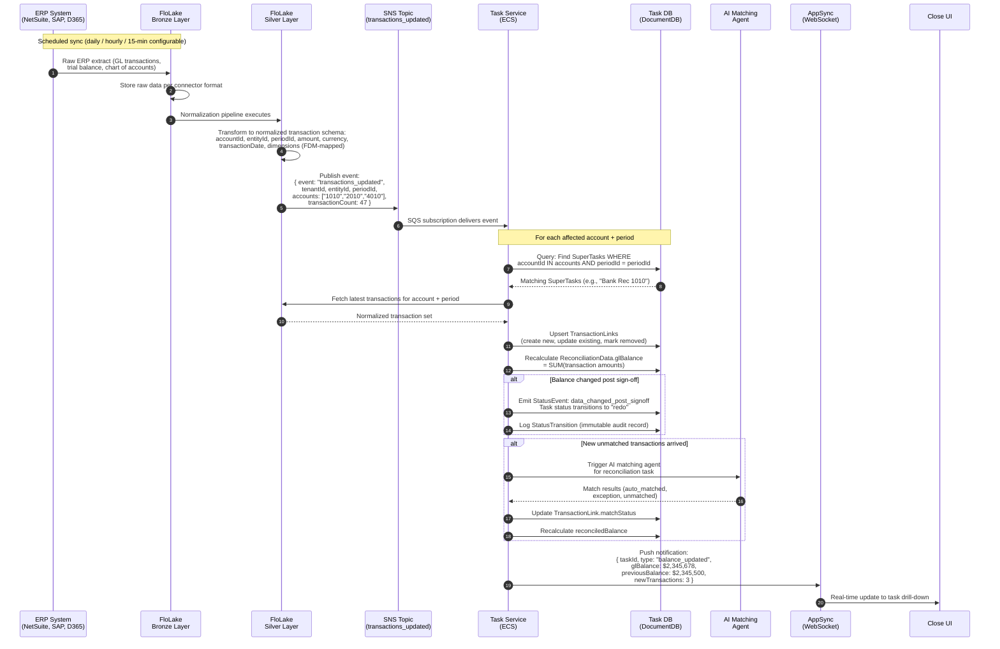

### Flowchart: ERP Ingestion Decision Logic

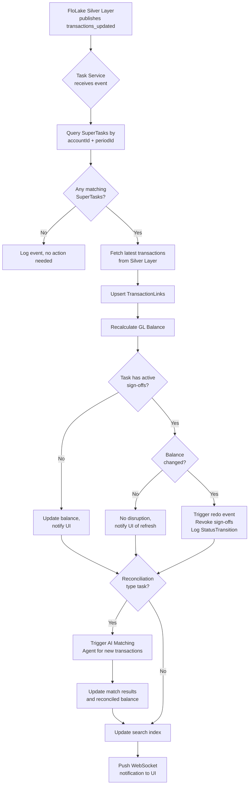

### What This Replaces

| Current State | Proposed State |
|---|---|
| `fq-gl-netsuite` Lambda pulls NetSuite TB directly | FloLake Bronze to Silver normalizes NetSuite data |
| `fq-gl-ms-dynamics` Lambda pulls D365 TB directly | FloLake Bronze to Silver normalizes D365 data |
| `fq-gl-sap` Lambda pulls SAP TB directly | FloLake Bronze to Silver normalizes SAP data |
| `fq-gl-tb` Lambda handles generic TB import | FloLake handles all connectors with unified schema |
| Each Lambda writes to `procedures` collection directly | Task Service consumes SNS events, updates SuperTasks |
| `#FQ` anchor tag scans Excel for reconciled balance | Balance computed from FloLake transactions in real time |
| Per-ERP credential management via `fq-gl-creds-lambda` | FloLake manages all ERP credentials centrally |
| Close and Reporting pull ERP data independently | Single FloLake ingestion serves both products |

---

## 2. Task State Transition Flow

### Context

The current checklist system relies on manual status toggling. Users click sign-off buttons, and status is directly set. There is no formal state machine, no dependency evaluation, and no event propagation. The proposed architecture introduces an event-driven status machine where every state change is a response to a concrete event, dependency chains cascade automatically, and every transition is logged immutably for audit compliance.

### Sequence Diagram

```mermaid
sequenceDiagram
    autonumber
    participant Actor as User / Agent /<br/>System Event
    participant API as Task Service<br/>API Layer
    participant SM as Status Machine<br/>Engine
    participant DB as Task DB<br/>(DocumentDB)
    participant Dep as Dependency<br/>Evaluator
    participant Notify as Notification<br/>Service
    participant Search as Search Service
    participant Analytics as Analytics<br/>Service (Snowflake)

    Actor->>API: Action (e.g., preparer_signed,<br/>agent_completed, data_changed_post_signoff)

    API->>API: Validate: auth, permissions (ReBAC),<br/>business rules (all sub-tasks complete?)

    API->>SM: Submit StatusEvent

    SM->>SM: Evaluate current state +<br/>event against transition rules
    SM->>SM: Compute new status<br/>(e.g., in_progress to pending_review)

    SM->>DB: Write StatusTransition:<br/>{ taskId, fromStatus, toStatus,<br/>  event, actorId, timestamp,<br/>  metadata }

    SM->>DB: Update SuperTask.status

    alt Event is a sign-off
        SM->>DB: Write Signature record:<br/>{ taskId, signatureType,<br/>  userId, timestamp, signatureHash }
    end

    SM->>Dep: Evaluate downstream dependencies

    Note over Dep,DB: Check: Which tasks depend<br/>on this task completing?
    Dep->>DB: Query Dependencies WHERE<br/>targetTaskId = this task
    DB-->>Dep: Dependent tasks list

    loop For each dependent task
        Dep->>Dep: Evaluate dependency condition<br/>(finish_to_start, data_dependency, etc.)
        alt Dependency now met
            Dep->>SM: Submit StatusEvent:<br/>dependency_met for dependent task
            SM->>DB: Transition dependent task<br/>from blocked to previous state
            SM->>DB: Log StatusTransition
        end
    end

    par Async fan-out
        SM->>Notify: Send notifications<br/>(in-app, email, Slack/Teams)
        SM->>Search: Emit task_updated event<br/>for search index
        SM->>Analytics: Emit event to Snowflake<br/>Gold Layer pipeline
    end

    Notify->>Actor: Task 'Bank Rec 1010' moved<br/>to Pending Review
```

### Flowchart: Status Machine Evaluation

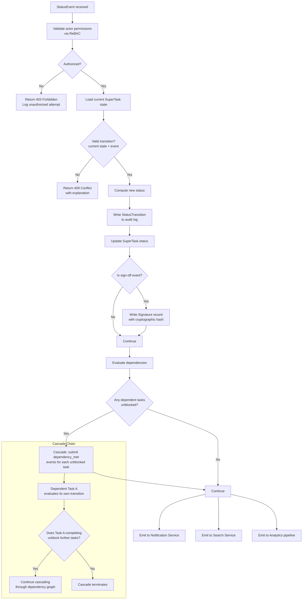

### Valid State Transitions

| Current Status | Event | New Status | Notes |
|---|---|---|---|
| `not_started` | `sub_task_started` | `in_progress` | First sub-task begins |
| `not_started` | `agent_started` | `agent_working` | AI agent begins processing |
| `agent_working` | `agent_completed` | `in_progress` | Agent done, human work remains |
| `in_progress` | `preparer_signed` | `pending_review` | Requires all sub-tasks complete |
| `pending_review` | `reviewer_signed` | `completed` | All required signatures obtained |
| `pending_review` | `review_note_created` | `changes_requested` | Reviewer sends back |
| `changes_requested` | `sub_task_started` | `in_progress` | Preparer resumes work |
| `completed` | `data_changed_post_signoff` | `redo` | Balance or data drift detected |
| `redo` | `sub_task_started` | `in_progress` | Re-work begins |
| *any* | `dependency_broken` | `blocked` | Upstream dependency no longer met |
| `blocked` | `dependency_met` | *previous state* | Restored to pre-blocked state |
| *any* | `task_skipped` | `skipped` | Intentionally excluded this period |

### Cascade Example: Month-End Sign-Off Chain

```
Revenue Accrual JE (preparer_signed -> pending_review -> reviewer_signed -> completed)
  |__ triggers dependency_met on:
      Revenue Variance Analysis (blocked -> not_started -> in_progress)
        |__ when completed, triggers dependency_met on:
            CFO Revenue Review (blocked -> not_started)
              |__ when completed, triggers dependency_met on:
                  Period Close Certification (blocked -> not_started)
```

This cascade replaces manual "traffic light" status indicators with automatic, auditable event propagation.

---

## 3. Search Indexing Flow

### Context

FloQast Close has no search infrastructure today. Users navigate exclusively through the folder hierarchy, entity/period selectors, and the checklist grid. Global Checklist and Global Reconciliation views provide cross-entity filtering, but only on predefined columns. There is no full-text search, no faceted filtering by tags, no search across review notes or document names, and no saved search queries.

The proposed architecture introduces a dedicated Search Service as a critical new capability, consuming events from the Task Service and maintaining a purpose-built search index. This is what enables the "search-first navigation" that Project Catalyst proposes and that both Mike Whitmire and Carlos Avila identified as the primary solution to navigation complexity.

### Sequence Diagram

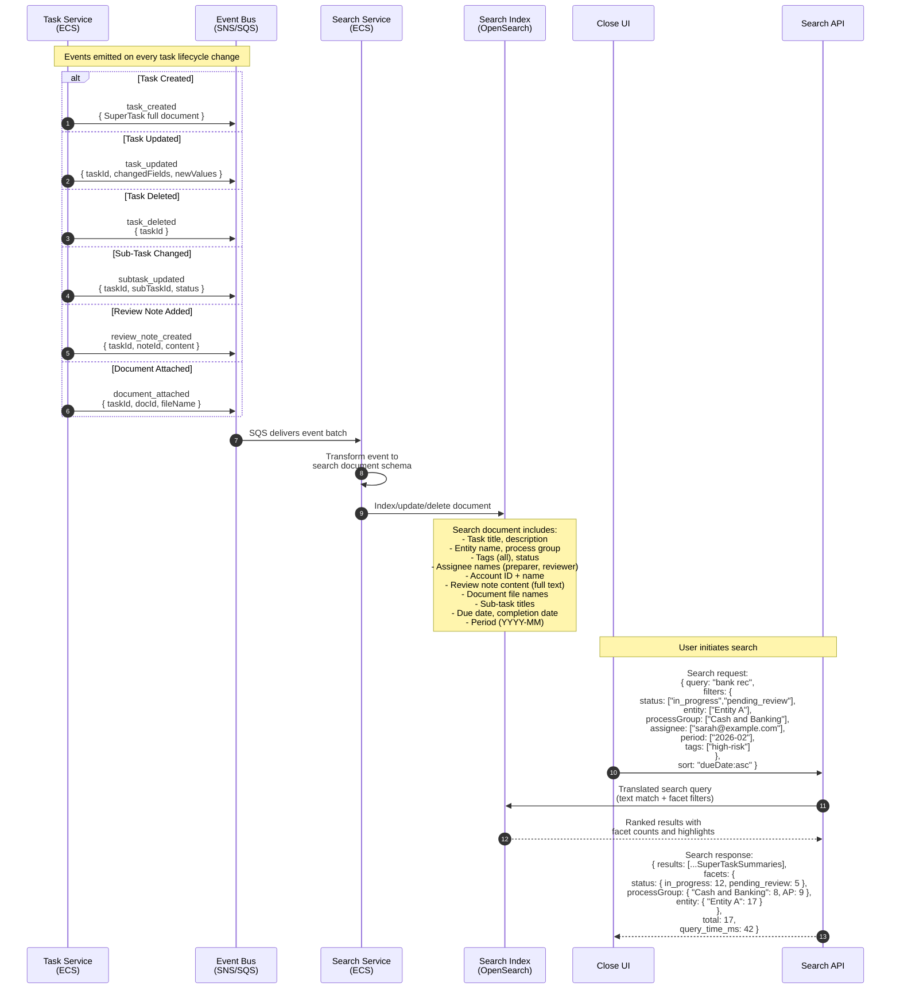

### Flowchart: Search Document Indexing Logic

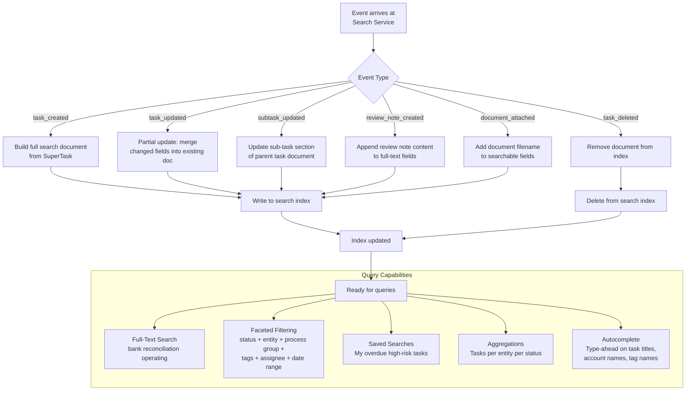

### Search Index Document Schema

```json
{
  "taskId": "st-abc-123",
  "tenantId": "tlc-001",
  "title": "Bank Rec - Operating Account 1010",
  "taskType": "reconciliation",
  "status": "pending_review",
  "entityId": "entity-a",
  "entityName": "Entity A",
  "periodId": "2026-02",
  "processGroup": "Cash & Banking",
  "accountId": "1010",
  "accountName": "Operating Cash Account",
  "preparerId": "user-sarah",
  "preparerName": "Sarah Chen",
  "reviewerId": "user-david",
  "reviewerName": "David Park",
  "dueDate": "2026-02-15",
  "completedDate": null,
  "tags": ["high-risk", "SOX-material", "intercompany"],
  "subTaskTitles": [
    "Import bank transactions",
    "Import GL transactions",
    "Match transactions",
    "Review exceptions",
    "Verify materiality",
    "Preparer sign-off",
    "Reviewer sign-off"
  ],
  "reviewNoteContent": "Please verify the three unmatched items...",
  "documentNames": ["Feb_2026_Bank_Statement.pdf", "Matching_Summary.xlsx"],
  "glBalance": 2345678.00,
  "variance": 178.50,
  "isOverdue": false,
  "fullText": "Bank Rec Operating Account 1010 Cash Banking high-risk..."
}
```

### What This Enables

| Capability | Current State | With Search Service |
|---|---|---|
| Find a task by name | Navigate entity, then period, then folder, then scan grid | Type "bank rec" in global search bar |
| Filter by tag | Limited tag filtering within a single folder view | Faceted filter across all entities and periods |
| Find tasks by assignee | Use "Assigned to Me" toggle per entity | Search "assignee:sarah" across entire organization |
| Find review notes | Navigate to specific task, then open review notes panel | Full-text search across all review note content |
| Cross-entity view | Global Checklist with limited column filters | Faceted search with entity as a filter dimension |
| Saved views | Not supported | Save search queries as bookmarks |

---

## 4. AI Agent Execution Flow

### Context

FloQast currently operates five separate AI services with different providers (OpenAI and AWS Bedrock), different runtimes (Node.js and Python), and independent deployment patterns. There is no unified orchestration layer -- AI Matching calls OpenAI directly, FloQL calls Bedrock directly, Checkmate calls OpenAI directly, and the Monitors Agent runs as a standalone Bedrock Agent. Each service independently manages model selection, prompt engineering, error handling, and execution logging.

The proposed architecture introduces a unified AI Orchestration layer that routes agent requests to the appropriate model, enforces tenant isolation, records execution metrics for ROI calculation, and integrates agent results directly into the Super Task model (via AgentExecution records and SubTask status updates).

### Sequence Diagram

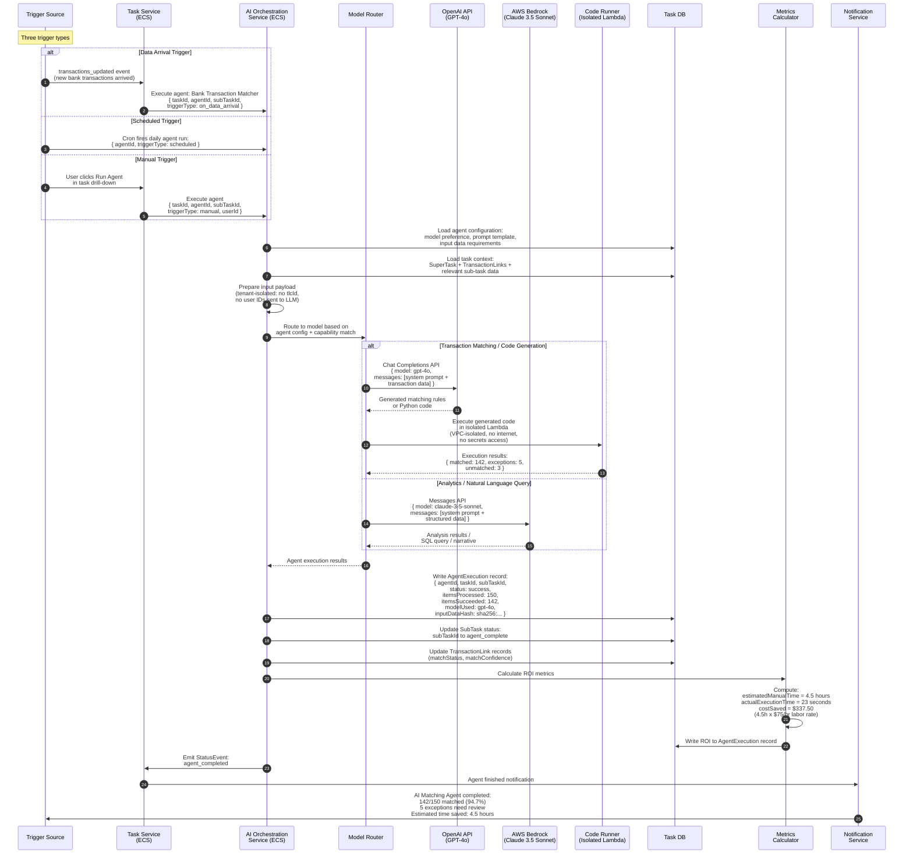

### Flowchart: AI Orchestration Decision Logic

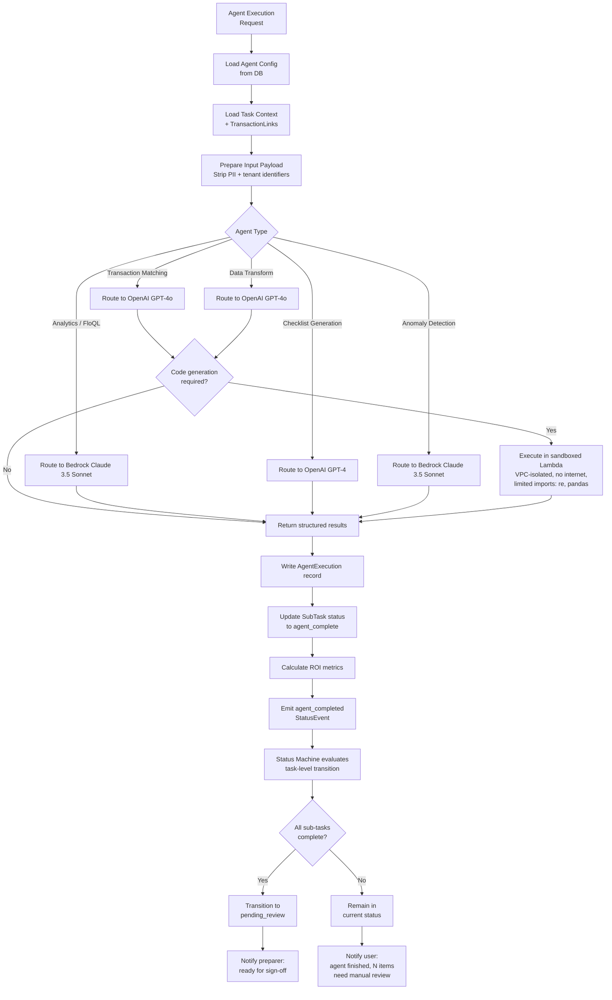

### What This Unifies

| Current Service | Provider | Proposed Integration |
|---|---|---|
| AI Matching (rules + code gen) | OpenAI GPT-4o | Routed through Orchestration; code execution in sandboxed Lambda |
| FloQL Backend (transaction analytics) | Bedrock Claude 3.5 Sonnet | Routed through Orchestration; results populate AIInsight entities |
| Monitors Agent (SQL generation) | Bedrock Claude 3.5 Sonnet v2 | Routed through Orchestration; scheduled execution pattern |
| Remind Language Processor | OpenAI GPT-4o | Routed through Orchestration; Notification Service integration |
| Checkmate (checklist generation) | OpenAI GPT-4 | Routed through Orchestration; creates SubTask templates |

### Tenant Isolation (Preserved)

The current AI security architecture is preserved and formalized:

- All data access scoped by `tlcId` at the API authorization layer
- `tlcId` and user IDs are never sent to LLM providers
- Transaction data sent to LLMs contains only structured fields (amounts, dates, descriptions)
- Code Runner Lambda operates in a dedicated VPC with no internet gateway
- Snowflake data accessed via schema-per-tenant: `TLC_{tlcId}`
- S3 data accessed via path prefix: `${tlcId}/...`

### Sandbox Security Controls (Preserved from Current Architecture)

| Control | Implementation |
|---|---|
| Network Isolation | Dedicated VPC with no internet gateway |
| Egress Restriction | Security group allows only S3 VPC endpoint (port 443) |
| Secret Denial | Explicit IAM DENY on all SSM/Secrets Manager operations |
| Limited Runtime | Only `re`, `pandas`, `defaultdict` available |
| Code Validation | Regex extraction -- only Python in markdown blocks accepted |
| Function Check | Must define `match_transactions` function |
| Time Limit | 900s maximum execution time |
| Memory Limit | 10GB maximum allocation |

---

## 5. Audit Trail Flow

### Context

The current audit trail relies primarily on the `signatures` array embedded within the `procedures` (checklist items) and `reconciliations` MongoDB collections. Sign-off timestamps, user IDs, and signature status are captured, but the trail covers only sign-off events. There is no centralized, immutable audit log for other state changes (delegations, agent executions, admin actions, permission changes). Platform teams have documented that 48 of 62 critical routes lack audit log coverage.

The proposed architecture expands the audit trail to cover every state change across the Super Task lifecycle. The trail is append-only, cryptographically linked, and queryable for compliance teams and external auditors.

### Sequence Diagram

```mermaid
sequenceDiagram
    autonumber
    participant Actor as Actor<br/>(User / Agent / System)
    participant TaskSvc as Task Service
    participant AuditSvc as Audit Service<br/>(ECS)
    participant AuditDB as Audit Store<br/>(Append-Only)
    participant Compliance as Compliance<br/>Query API
    participant Export as Export Service
    participant Auditor as External Auditor

    Note over Actor,AuditSvc: Every auditable action generates an audit event

    alt State Change
        Actor->>TaskSvc: preparer_signed / reviewer_signed /<br/>agent_completed / status change
        TaskSvc->>AuditSvc: AuditEvent: StatusTransition<br/>{ taskId, fromStatus, toStatus,<br/>  actorId, actorType, timestamp,<br/>  eventType, metadata }
    else Sign-Off
        Actor->>TaskSvc: Sign-off action
        TaskSvc->>AuditSvc: AuditEvent: Signature<br/>{ taskId, signatureType,<br/>  userId, timestamp,<br/>  signatureHash (SHA-256),<br/>  previousSignatureHash }
    else Delegation
        Actor->>TaskSvc: Delegate task to another user
        TaskSvc->>AuditSvc: AuditEvent: Delegation<br/>{ taskId, fromUserId, toUserId,<br/>  reason, startDate, endDate,<br/>  authorizedBy }
    else Agent Execution
        Actor->>TaskSvc: Agent completes sub-task
        TaskSvc->>AuditSvc: AuditEvent: AgentExecution<br/>{ taskId, subTaskId, agentId,<br/>  modelUsed, inputDataHash,<br/>  itemsProcessed, results }
    else Admin Action
        Actor->>TaskSvc: Permission change / role assignment /<br/>template modification / period lock
        TaskSvc->>AuditSvc: AuditEvent: AdminAction<br/>{ actionType, targetEntity,<br/>  previousValue, newValue,<br/>  authorizedBy }
    end

    AuditSvc->>AuditSvc: Validate event schema
    AuditSvc->>AuditSvc: Compute chain hash:<br/>hash = SHA-256(previousHash + eventData)
    AuditSvc->>AuditDB: Append to immutable store<br/>(no updates, no deletes)

    Note over Compliance: Compliance team queries

    Compliance->>AuditDB: Query: All sign-offs for<br/>Entity A, Feb 2026 period,<br/>SOX-material tagged tasks
    AuditDB-->>Compliance: Filtered audit records with<br/>complete chain of custody

    Compliance->>AuditDB: Query: All delegations where<br/>segregation of duties may be impacted
    AuditDB-->>Compliance: Delegation records with<br/>role overlap analysis

    Note over Export,Auditor: External audit export

    Compliance->>Export: Request audit export:<br/>{ entityIds, periodId, format: xlsx }
    Export->>AuditDB: Bulk read audit records
    AuditDB-->>Export: Complete audit trail
    Export->>Export: Generate formatted export<br/>(Excel with chain verification)
    Export->>Auditor: Signed, timestamped<br/>audit package (S3 signed URL)
```

### Flowchart: Audit Event Processing

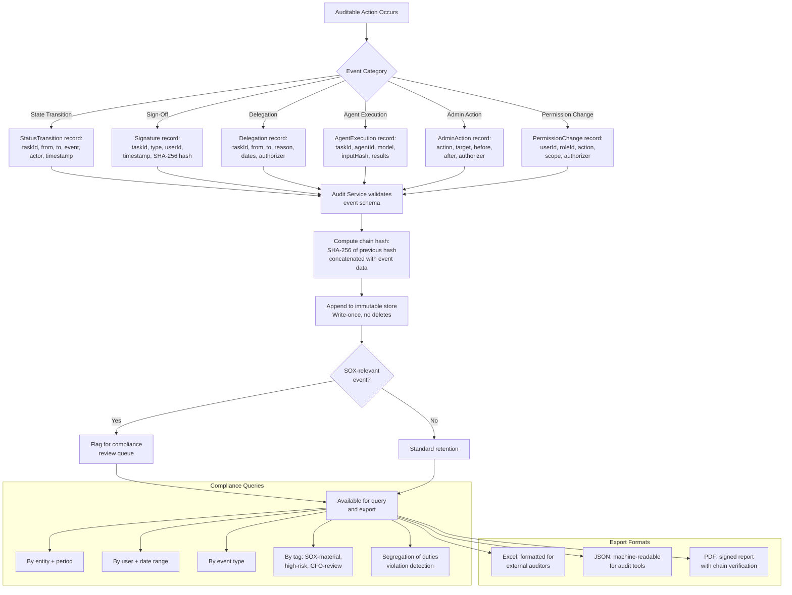

### Audit Entity Relationships

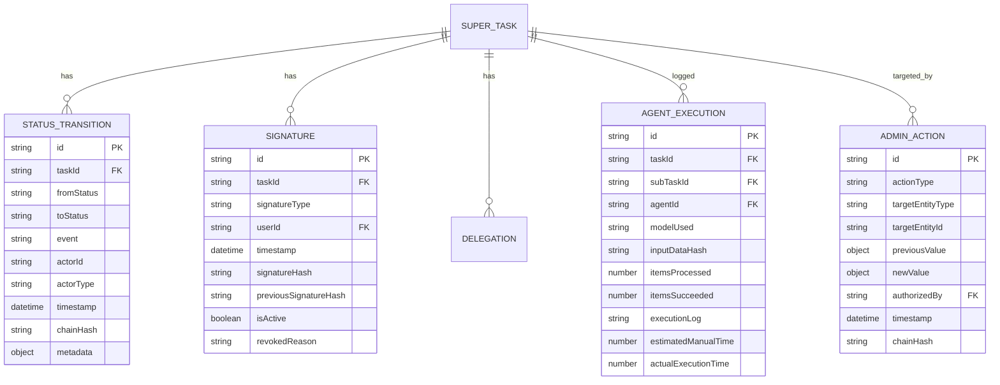

### What This Expands

| Current Coverage | Proposed Coverage |
|---|---|
| Sign-off timestamps on `procedures` | Sign-offs as first-class Signature entities with cryptographic hashes |
| Sign-off timestamps on `reconciliations` | All task types covered under unified Signature model |
| No delegation audit trail | Full delegation history with reason, dates, authorizer |
| No agent execution audit trail | Complete AgentExecution records with model, input hash, results |
| No admin action audit trail | Every permission change, role assignment, period lock, template edit |
| 48 of 62 critical routes lack audit logs | All state-changing routes produce audit events |
| No chain verification | SHA-256 hash chain for tamper detection |
| Manual export via Workflow Analytics | Structured export API with multiple formats |

---

## 6. Cross-Product Sync Flow

### Context

Today, Close and Reporting operate on completely separate data paths. A customer's NetSuite integration for Close and their NetSuite integration for Reporting are essentially independent. The Reporting team has already rearchitected around transactions as the atomic entity, with FloLake's Silver Layer normalizing ERP data and the FDM (Financial Data Model) service providing dimension groupings. Close has no knowledge of Reporting's data, and Reporting has no awareness of Close task status.

The proposed architecture creates a bidirectional bridge where Reporting transactions surface in Close task drill-downs (enriched with FDM dimension context), and Close task completion status surfaces in Reporting dashboards (enabling "close-aware" financial reports).

### Sequence Diagram: Reporting to Close (Transactions Surface in Tasks)

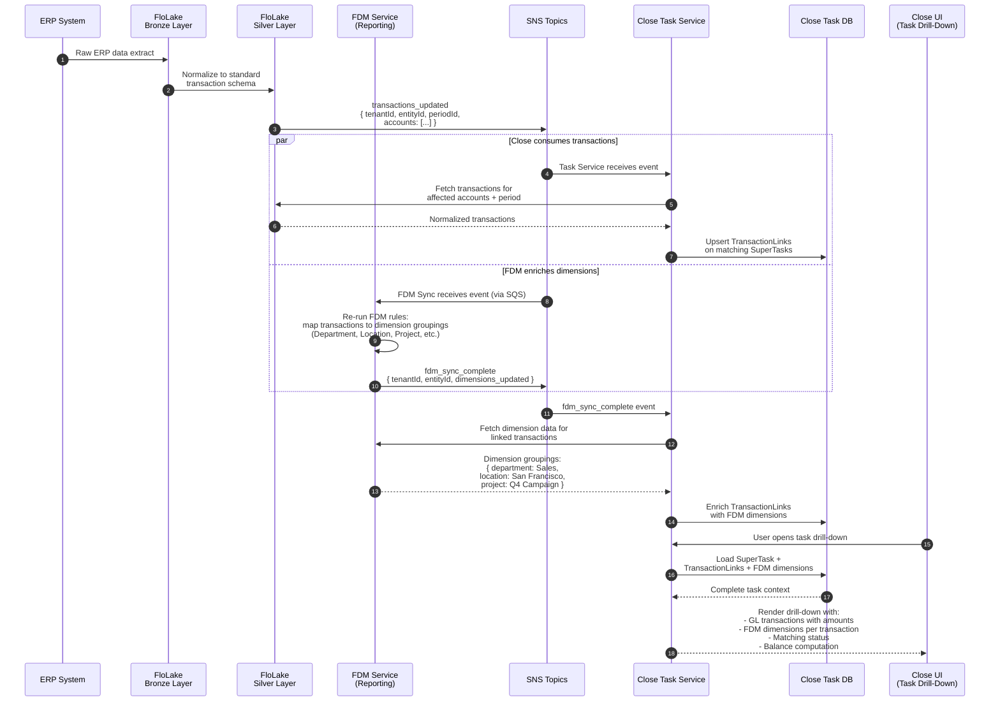

### Sequence Diagram: Close to Reporting (Task Status Surfaces in Reports)

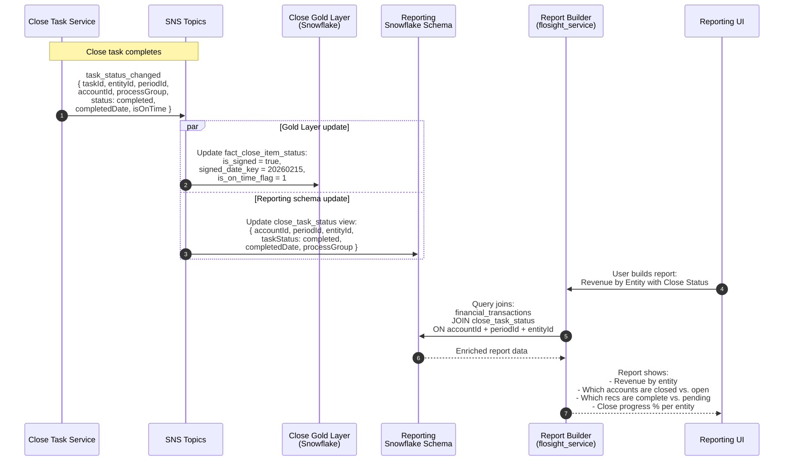

### Flowchart: Bidirectional Data Bridge

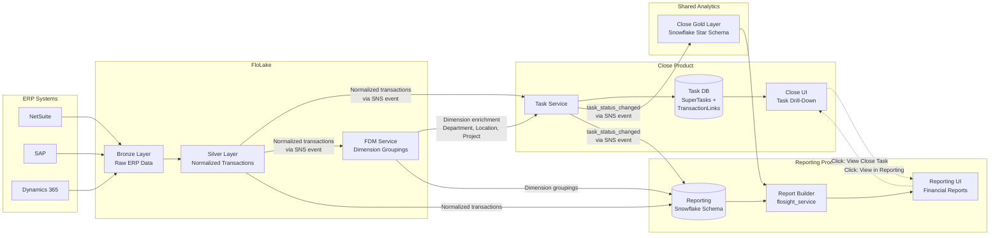

### Data Contracts Between Products

| Direction | Data | Transport | Event/Schema |
|---|---|---|---|
| FloLake to Close | Normalized transactions | SNS to SQS subscription | `{ tenantId, entityId, periodId, accounts[], transactionCount }` |
| FloLake to Reporting | Normalized transactions | Direct Snowflake write | FloLake Silver Layer schema (per-tenant Snowflake schema) |
| FDM to Close | Dimension groupings | HTTP API call (after SNS trigger) | `{ accountId, dimensions: { department, location, project, ... } }` |
| FDM to Reporting | Dimension groupings | Direct Snowflake write | FDM dimension tables in per-tenant schema |
| Close to Gold Layer | Task status events | SNS to Snowflake pipeline | `fact_close_item_status` star schema (see Gold Layer Data Model V1.0) |
| Close to Reporting | Task completion status | SNS to SQS subscription | `{ taskId, entityId, periodId, accountId, status, completedDate, isOnTime }` |
| Reporting to Close | Deep-link navigation | URL routing | `/reporting?account={id}&period={id}&entity={id}` |
| Close to Reporting | Deep-link navigation | URL routing | `/close/task/{taskId}` |

### FDM Dimension Enrichment Detail

The FDM service provides dimension groupings that transform raw account data into meaningful business context. When a transaction arrives in a Close task drill-down, it carries not just the amount and date, but the full organizational context:

```
Transaction: Wire payment -$12,345 (Feb 5, 2026)
  Account: 1010 - Operating Cash

  FDM Dimensions:
  +-- Department:    Treasury
  +-- Location:      San Francisco HQ
  +-- Cost Center:   CC-100 (Corporate)
  +-- Project:       N/A
  +-- Intercompany:  No
  +-- Custom Dim 1:  Domestic Operations

This enrichment happens automatically via the FDM sync pipeline.
The reviewer sees business context without leaving the task drill-down.
```

### Cross-Product Query Examples

| Query | Current State | With Cross-Product Bridge |
|---|---|---|
| Show me the transactions behind this rec variance | Must open Excel workbook | Click variance, see transactions inline in drill-down |
| What is the GL activity for this account this period? | Navigate to Reporting module | Visible in Super Task drill-down via TransactionLinks |
| Compare this rec to last month's transactions | Manual period toggle + Excel comparison | Side-by-side in task view with period-over-period data |
| Which recs are affected by today's JE posting? | Unknown until next refresh cycle | Real-time notification via SNS event cascade |
| Show me all transactions above $50K across all entities | Not possible in Close | Search query with amount filter via Search Service |
| Which accounts in this report are still open for close? | Not possible in Reporting | Close status badge on report line items |

---

## Summary: Data Flow Integration Map

The following diagram shows how all six data flows interconnect within the proposed architecture.

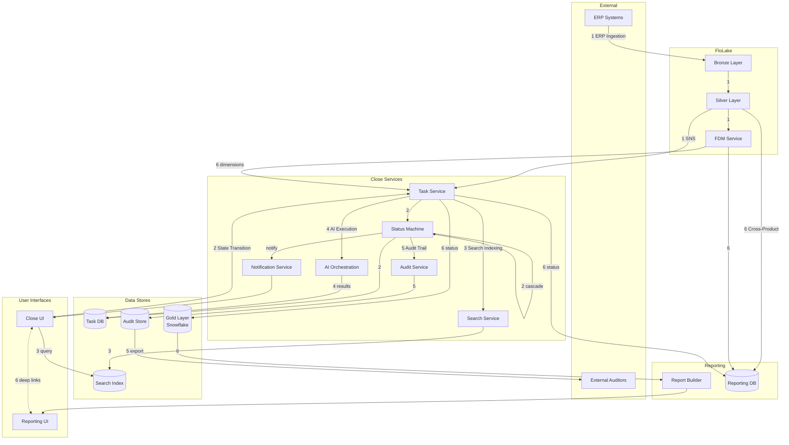

### Flow Summary

| Flow | Primary Path | Event Transport | Key Innovation |
|---|---|---|---|
| 1. ERP Ingestion | ERP to FloLake to SNS to Task Service | SNS/SQS | Eliminates per-ERP GL Provider Lambdas; single ingestion serves all products |
| 2. Task State Transition | User/Agent to Status Machine to Dependency Cascade | Synchronous + event cascade | Automatic sign-off cascading through dependency chains |
| 3. Search Indexing | Task Service to Search Service to Search Index | SNS/SQS | Entirely new capability; enables search-first navigation |
| 4. AI Agent Execution | Trigger to AI Orchestration to Model to Task | Request/response + async | Unified orchestration replaces five fragmented AI services |
| 5. Audit Trail | Every state change to Audit Service to Immutable Store | Synchronous append | Expands from sign-off-only to full lifecycle audit with chain verification |
| 6. Cross-Product Sync | FloLake to/from Close to/from Reporting | SNS/SQS + Snowflake | First-ever bidirectional data flow between Close and Reporting |

### Communication Pattern Summary

| Flow | Async Pattern | Sync Pattern |
|---|---|---|
| 1. ERP Ingestion | SNS/SQS from FloLake to Close and Reporting | HTTP from Task Service to Silver Layer for transaction fetch |
| 2. Task State Transition | SNS fan-out to Search, Analytics, Notifications | Synchronous status machine evaluation and DB writes |
| 3. Search Indexing | SNS/SQS from Task Service to Search Service | HTTP search query from UI to Search API |
| 4. AI Agent Execution | SQS for scheduled and data-arrival triggers | HTTP from Orchestration to OpenAI/Bedrock APIs |
| 5. Audit Trail | Async audit event writes (non-blocking to primary flow) | Sync audit query and export request |
| 6. Cross-Product Sync | SNS fan-out to all consuming products | HTTP deep-link navigation between UIs |

### Architectural Principles Reflected

1. **Event-driven over request-driven** -- All cross-service communication uses async events (SNS/SQS), eliminating tight coupling between Close and other products. This follows the pattern the Reporting team established with FDM Sync.

2. **Single source of truth** -- FloLake Silver Layer is the single source for transaction data; the Task Service is the single source for task state; the Audit Store is the single source for audit events.

3. **Immutability for compliance** -- Audit events, signatures with cryptographic hashes, and status transitions are append-only. Nothing is edited or deleted.

4. **Eventual consistency with real-time UX** -- Cross-product data is eventually consistent (async fan-out), but users see real-time updates via WebSocket push on the surfaces they are viewing.

5. **Tenant isolation at every layer** -- Snowflake schema-per-tenant, `tlcId` on all events and queries, ReBAC permission filtering at query time, PII stripping before AI processing.

6. **Aligns with existing Reporting patterns** -- The SNS/SQS fan-out, FloLake Silver Layer consumption, and Snowflake Gold Layer writing all follow patterns the Reporting team has already established with FDM Sync and Report Builder. Close is adopting proven patterns rather than inventing new ones.

---

*Document Author: Benjamin Ellis, Product Design Manager*
*Date: March 2026*
*Status: Architecture Proposal -- Living Document*
