# Persona 1 — Journey Maps

Two flows for the **Accounting Manager** (1st line of defense) — the person who builds and runs the AI agent day-to-day and bears the recurring testing obligations that COSO codifies for AI controls.

The diagrams are also rendered in FigJam — open here: <https://www.figma.com/board/pHKNEq9VYPXcWtGXAnZcdo>

The Mermaid source is included below so it can be pasted into a FigJam Mermaid widget, regenerated, or modified in any other tool.

## Personas referenced

- **P1** — Accounting Manager (1st line) — owns the agent
- **P2** — IT/Compliance Manager (2nd line) — designs and validates the program
- **Auditor** — Internal/External Auditor (3rd line) — independent assurance

---

## Journey 1 — Agent creation & compliance setup

A one-time flow that runs every time P1 builds a new agent in Transform. It establishes the agent's risks, controls, and ownership before it goes live.

```mermaid
flowchart LR
  build(["P1 builds agent in Transform"])
  register["System auto-registers agent in Key Systems"]
  automap["FQ AI proposes capabilities, risks, and controls"]
  notify["P1 sees Up next: review risk assessment"]
  review{"Mapping looks right?"}
  customize["P1 annotates or adds a custom risk"]
  send["Route to Compliance Manager (P2)"]
  p2review["P2 validates controls and assigns owners"]
  live(["Agent goes live, controls active"])
  evidence["Run logs and approvals captured automatically"]

  build --> register
  register --> automap
  automap --> notify
  notify --> review
  review -->|"Yes"| send
  review -->|"Needs adjustment"| customize
  customize --> send
  send --> p2review
  p2review --> live
  live --> evidence
```

### Phase notes

| Phase | What P1 sees | What the system captures |
| --- | --- | --- |
| Build agent | Standard Transform agent builder; nothing compliance-flavored yet | Agent metadata: prompt, model version, owner |
| Auto-register | Toast notification "Registered in Key Systems" | Asset record in compliance inventory; capabilities inferred from agent definition |
| Auto-mapping | "Up next" task surfaces in Transform and the AI agent inventory | Capability → risks → recommended controls payload |
| Review mapping | Inline panel with the proposed assessment, broken down by capability | P1's review session, time spent, scroll depth |
| Customize / accept | Form to add a custom risk or annotate; "Send for acceptance" CTA | New risks (with `isCustom: true`), annotations, route record |
| P2 validation | (Not P1's screen — handoff) | P2's edits, control assignments, sign-off |
| Goes live | "Active" pill replaces the "Awaiting review" status | Activation timestamp, initial control state |

### Pain points to design against

- P1 is not a compliance person; the review step needs a friendly, plain-language summary of what each control means
- Capability mapping is opaque — show *why* a capability was chosen with one clear sentence
- The "Send for acceptance" handoff to P2 should never block P1's actual close work; agent can run before formal sign-off, with results gated until P2 approves

---

## Journey 2 — Day-to-day operation & ongoing compliance

The recurring loop that P1 lives in once the agent is live. Most steps run on auto-pilot; P1 only steps in for exceptions, recurring tests, and gap remediation.

```mermaid
flowchart LR
  run(["Scheduled run kicks off"])
  triage["P1 reviews exception queue"]
  decide["Approve, edit, or reject each item"]
  multi["Multi-level approval if material"]
  evidence["Run logs and approvals auto-captured"]
  pushTask["P2 pushes recurring accuracy test"]
  runTest["P1 runs test vs. ground truth"]
  outcome{"Result?"}
  closeTest["Close test, attach evidence"]
  gap["Open gap: P1 + P2 investigate"]
  remediate["Remediation tracked to closure"]
  recert(["Annual reliance attestation"])
  auditor["Auditor walks through the trail"]

  run --> triage
  triage --> decide
  decide --> multi
  multi --> evidence
  evidence --> pushTask
  pushTask --> runTest
  runTest --> outcome
  outcome -->|"Pass"| closeTest
  outcome -->|"Fail"| gap
  gap --> remediate
  closeTest --> recert
  remediate --> recert
  recert --> auditor
```

### Phase notes

| Phase | What P1 sees | What the system captures |
| --- | --- | --- |
| Scheduled run | Output items in Transform inbox | Run log, prompt + model versions, plugin list (AI BoM control) |
| Exception queue | Confidence-flagged items grouped at the top | Confidence score per item, time-to-decision |
| Approve / edit / reject | Inline action per item | Edit deltas, rejection reasons |
| Multi-level approval | Routing chain shown when amount exceeds the materiality threshold | Approver chain, sign-off timestamps, materiality breach record |
| Auto-captured evidence | (Background) | Approval log, run summary, exception summary |
| Pushed recurring task | Notification: "Quarterly accuracy test due" with one-click start | Task acknowledgement, test start time |
| Run accuracy test | Dedicated test page with sample comparison | Sample selection, comparison results, P1's commentary |
| Close test (pass) | Green confirmation | Test result + signed evidence |
| Open gap (fail) | Amber callout — links to investigate flow | Gap record, severity, owner assignment |
| Remediation | Per-gap progress tracker | Steps taken, retest results, closure record |
| Annual recertification | Formal attestation flow | P1's signed attestation, full evidence package |
| Audit access | (Not P1's screen — handoff) | Read-only export for the auditor |

### Pain points to design against

- Exception queue must be triagable in minutes, not hours — the agent's value depends on it
- Multi-level approval routing needs to be obvious; P1 shouldn't have to remember thresholds
- Recurring tests should never feel like surprise homework; cadence and scope must be visible weeks in advance
- Failed tests need to land softly: clear next step ("investigate") and shared ownership with P2 so P1 doesn't carry the gap alone

---

## Open questions raised by these journeys

1. **Where does Transform end and the compliance module begin for P1?** The risk-assessment review (in Journey 1) could live inside Transform itself or in the compliance module. The Figma entry-points show it on the compliance side, which means P1 has to context-switch.
2. **Pre-approval blocking vs. shadow runs.** Should an agent's outputs be usable before P2 signs off the controls, or only afterward? Affects how disruptive the setup flow feels.
3. **Cadence ownership.** Does P2 set test cadence per agent, or is it inherited from the COSO capability template? Persona 2 doc implies the latter; check with Vicky's team.
4. **Multi-level approval policy.** Today FloQast Close has multi-step sign-offs at the close-level; this proposes per-output approvals. Net new behavior — needs Persona 1 research.
