# Transform Extract — Configuration Panel State Model

Reference for engineers building the Document Extraction step. Describes the state machine inside the configuration panel: how the schema, files, and processed values relate; what transitions are allowed; what each transition shows in the UI; and which destructive actions require confirmation.

**Verified against** `prototype/template-builder.html` on **2026-05-14**.

---

## 1. Where this fits in the app

A Transform agent is a canvas of one or more step cards. Clicking a step opens a full-width configuration panel for that step. The state machine below describes the **right side** of that panel — the schema / processing / save flow.

```
┌──────────────────────────────────────────────┐
│ Coupa Unbilled Accruals                  Run │  ← page bar
├──────────────────────────────────────────────┤
│                                              │
│            ┌──────────────────┐              │  Canvas view
│            │ ● Process Inv… │ ← step card   │  (dotted = unsaved)
│            └──────────────────┘              │
│                                              │
└──────────────────────────────────────────────┘
        ▲ click step           │ click ×
        │                      ▼
┌──────────────────────────────────────────────┐
│ Process Invoices  Document Extraction   × │   ← config panel
├──────────────────┬───────────────────────────┤
│                  │                           │
│   PDF preview    │   Right panel  ←─ this    │
│                  │                  doc      │
│                  │                           │
└──────────────────┴───────────────────────────┘
```

The canvas-↔-config toggle lives in `openStepConfig()` / `closeStepConfig()`. Everything else in this doc is the right-panel state.

---

## 2. Concepts

**Template** — starter content. Picking a template **seeds a new schema**; the link is one-shot, not a live reference.

**Schema** — the actual field set attached to a step. Each step has exactly one schema. A schema may have originated from a template or been built from scratch.

**Implication:** there is **no template dropdown on the output form**. Template selection happens only on the A-state landing (creates a schema) or from inside the schema editor (seeds / replaces the in-progress schema).

**Files** — uploaded documents. File presence is orthogonal to schema state. In **B** the Process button enables/disables on `filesLoaded`; otherwise the file state is implied by the panel state (D/E both require files).

---

## 3. States

| State | Name | Description | UI cues |
|---|---|---|---|
| **A** | Initial | No schema assigned. | Template gallery + "+ New Schema" card. Process disabled. Save disabled. |
| **B** | Blank output form | Schema assigned, no extracted values. Files optional. | Top-aligned right panel. Process button **primary green** when files are loaded, disabled otherwise. Save disabled. Invalidate banner shown if arrived from D. |
| **C** | Schema editor | Full-screen editor. Field list editable. Schema can be seeded from a template, started from scratch, or hand-edited. | Editor toolbar: **Back**, **Discard schema** (if origin ≠ A), **Save Schema**. Remembers origin (A / B / D). |
| **P** | Processing | Extraction running. Prior values cleared; results pending. | Process button shows loading state and is disabled. Per-doc area is blank during P. Values return all at once on completion. Save, Edit Schema, and file delete are all refused. No cancel affordance (v1). |
| **D** | Output form (results) | Processed values populated. Per-doc validation runs. | Data bar shows file name. Process button reads **"Re-process"** (outline style). Save enabled. |
| **E** | Output form (saved) | Locked / read-only after Save. | Green "Saved" banner with **Unlock** link. Save button reads **"✓ Saved"**. Edit Schema / delete files / re-process all refused with a toast suggesting Unlock. |

---

## 4. State diagram

```mermaid
stateDiagram-v2
  direction LR
  [*] --> A: Step opened

  A: A. Initial (no schema)
  B: B. Output form (blank)
  C: C. Schema editor
  P: P. Processing
  D: D. Output form (results)
  E: E. Output form (saved)

  A --> C: Choose template — seeds editor (origin=A)
  A --> C: + New Schema — blank editor (origin=A)

  B --> C: Edit Schema (origin=B)
  B --> P: Process Documents

  C --> A: Back (origin=A)
  C --> B: Back (origin=B)
  C --> D: Back (origin=D)
  C --> A: Discard schema (confirm; clears values if origin=D)
  C --> B: Save (origin=A or B)
  C --> B: Save (origin=D) — confirm, invalidates D
  C --> C: Seed new template / start from scratch — confirm if schema loaded

  P --> D: Extraction complete

  D --> C: Edit Schema (origin=D)
  D --> B: Delete files — confirm, invalidates
  D --> P: Re-process — confirm, replaces values
  D --> E: Save (toolbar)

  E --> D: Unlock
```



Refusals in **E** are described in §7 rather than drawn, to keep the diagram readable.

---

## 5. Destructive-action confirms

Any action that would discard processed values or replace the current schema requires a modal confirm. The modal explains exactly what will be lost.

| Trigger | Modal title | Modal message | On confirm |
|---|---|---|---|
| Save schema edits, origin=D | Clear processed values? | This will clear the **N** values you've already extracted. Re-process to update them. | C → B + invalidate banner |
| Seed new template inside editor when a schema is already loaded | Replace current schema? | This will replace your current schema with the **[template]** template. Unsaved field changes will be lost. | Editor reloads with new seed |
| Start from scratch inside editor when a schema is already loaded | Discard current schema? | This will clear all fields in the editor. | Editor reloads blank |
| Discard schema (editor toolbar) | Discard schema? | This will remove the current schema and return you to the template picker. *(+ "Extracted values from **N** processed documents will be cleared." if origin=D)* | C → A; clears values if origin=D |
| Delete files in D | Discard processed values? | This will remove **N** uploaded files and clear the **N** values you've extracted. | D → B + invalidate banner |
| Re-process in D | Replace processed values? | This will re-run extraction and replace the **N** values currently shown. | D → P → D when complete |

All confirms route through `showConfirmModal({ title, message, confirmLabel, onConfirm })`.

---

## 6. Invalidate banner

Some destructive confirms move the right panel back to **B** with values cleared. A persistent amber banner in the per-doc area then signals the cause:

| Trigger | Banner title | Banner message |
|---|---|---|
| Save schema edits (origin=D) | Results are out of date | Schema updated. Click **Process** again to update extracted values. |
| Delete files in D | Files were removed | Upload new documents and click **Process** to extract values. |

Banner hides when:
- Process button is clicked (transition to P), or
- Files are re-uploaded after a delete (Process button is now primary green — sufficient cue).

Hook: `invalidate(reasonHtml)`.

---

## 7. Approved state (E) refusals

In **E**, the following actions are refused with a chat-style toast suggesting Unlock first:

- Edit Schema link
- Delete files (trash icon)
- Re-process

**Unlock** returns to **D** with values intact and editable. Does not invalidate — data is still valid. Subsequent destructive actions invalidate normally (with their confirms).

Hook: `handleUnlock()`.

---

## 8. Editor origin tracking

`C` remembers where it was opened from via `editorOrigin` (`'A'` / `'B'` / `'D'`).

- **Back** always returns to origin unchanged.
- **Save** returns to origin and (if origin=`D`) triggers the invalidate confirm before transitioning.
- **Discard schema** always lands in `A`; if origin=`D` it also clears processed values.

---

## 9. Why no in-place "Change template" on the output form

Templates are not live references — they only seed schemas. Once a schema is assigned, swapping templates would be ambiguous: replace the whole schema? merge fields? overwrite labels?

To avoid this ambiguity, template selection lives only in:

1. **A-state landing** — picks a template and opens the schema editor pre-seeded. The user can refine before saving.
2. **Schema editor** — has explicit **Seed from template** and **Start from scratch** actions, each guarded by a confirm when an existing schema is loaded.

---

## 10. Implementation hooks (prototype)

For engineers picking this up from `prototype/template-builder.html`:

| Concern | Hook |
|---|---|
| Canvas ↔ config toggle | `openStepConfig()`, `closeStepConfig()` |
| Editor origin tracking | `editorOrigin` (let var); set in `showEditor()` |
| Editor entry | `showEditor()` |
| Editor Back | `handleEditorCancel()` |
| Editor Save | `#saveEditor` click handler |
| Editor Discard schema | `#discardSchemaBtn` → `performDiscardSchema()` |
| Process / Re-process | `handleProcess()`, `runProcessing()` |
| Save extracted values | `handleApprove()` |
| Unlock saved values | `handleUnlock()` |
| Delete files | `handleDeleteAll()` |
| Invalidate D → B | `invalidate(reasonHtml)` |
| Confirm modal | `showConfirmModal({ title, message, confirmLabel, onConfirm })` |
| State predicate | `isInDState()` |
| Landing / form switches | `showLandingState()`, `showSchemaAssignedState()`, `showValues()` |

Banners and key elements: `#reprocessBanner`, `#validationBanner`, `#approvedBanner`, `#dataBar`, `#processBtn`, `#approveBtn`, `#schemaName`, `#schemaTitleInput`, `#editorInline`, `#landingSection`, `#formView`, `#outputEmpty`, `#outputPopulated`.

---

## 11. Out of scope (v1)

- Cancel during P (processing is uninterruptible in v1).
- Per-field re-processing or partial re-runs from D.
- Multiple schemas per step.
- Step-saved vs. step-unsaved on the canvas (currently every step renders with a dashed border to indicate unsaved; persisted saved-state styling is a follow-up).
- Live template references (see §9).

---

## Reference

- Original state diagram (pre-decisions, TBDs intact): [`state-diagram-original.png`](state-diagram-original.png)
- Implementation: [`../prototype/template-builder.html`](../prototype/template-builder.html)
- Related research: [`research-template-vs-schema-patterns.md`](research-template-vs-schema-patterns.md)
